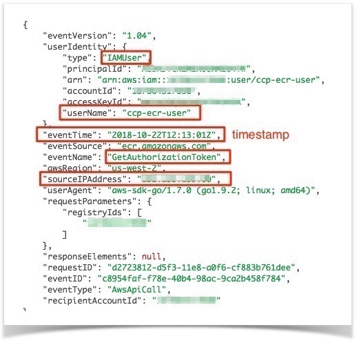
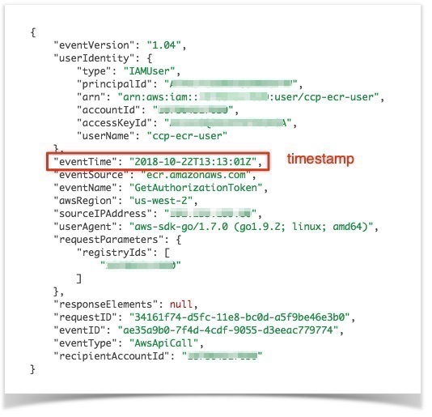

# Problem Statement
Kubernetes offers native ECR support for [nodes running on AWS ec2 instances](https://kubernetes.io/docs/concepts/containers/images/#using-aws-ec2-container-registry). In order for this to work, the nodes need to be granted sufficient privileges via an IAM instance profile whereby they are dynamically granted ephemeral credentials via the ec2 metadata (and STS) service.

Kubernetes clusters hosted on **non-AWS infrastructure** cannot be assigned IAM instance profiles. Furthermore, unlike e.g. hub.docker.com, ECR does not support the notion of serving 'public' container images. While ECR makes it possible for images to be accessed by other AWS accounts/users/roles, this must be explicitly configured via IAM and requires both an ECR and Docker login step before access to an image/repo is granted. Due to a 12 hour expiry timer on the returned Docker token, this must be repeated within 12 hours. As such, it is currently not possible to access an ECR repo without, at least initially, interacting with IAM.


# Solution Overview

For non-AWS hosted k8s, the solution outlined here will enable ECR registry credentials to be refreshed every 60 minutes. This solution updates *imagePullSecrets* within every default *service account* across all namespaces.

As described in the [registry-creds](https://github.com/upmc-enterprises/registry-creds) GitHub repo:

* The tool runs as a pod in the kube-system namespace.
* It gets credentials from AWS ECR or Google Container Registry
* Next it creates a secret with credentials for your registry
* Then it sets up this secret to be used in the *ImagePullSecrets* for the default service account
* Whenever a pod is created, this secret is attached to the pod
* The container will refresh the credentials by default every 60 minutes


Note: this solution works across all namespaces. The default serviceaccount for each namespace (including newly created namespaces) is dynamically updated with *imagePullSecrets*:

```
$ kubectl get serviceaccounts default -n development -o yaml

apiVersion: v1
imagePullSecrets:
- name: awsecr-cred
...
...

$ kubectl get secrets -n development

NAME                  TYPE                                  DATA   AGE
awsecr-cred           kubernetes.io/dockerconfigjson        1      37m
```

If an application manifest does not specify a *serviceaccount* or an *imagePullSecret* for an image residing in a private repo, then the *imagePullSecret* from the default serviceaccount will be used.

This can be verified via:

```
kubectl get pod nginx-deployment-6588884f9b-fh98x -n development -o yaml

<snip>

spec:
  <snip>
  imagePullSecrets:
  - name: awsecr-cred

```

# ECR (pull) Workflow Refresher
In a manual workflow, the following sequence of manual steps would typically be executed to 'pull' an image from an ECR registry:

First, request a login from ECR:

```
aws ecr get-login --region us-west-2 --no-include-email
```

From the resulting output above (omitted for brevity) perform a Docker login:

```
docker login -u AWS -p <huge_long_token> https://<AWS_ACCOUNT_ID>.dkr.ecr.us-west-2.amazonaws.com
```

And now the image can be pulled:

```
docker pull <AWS_ACCOUNT_ID>.dkr.ecr.us-west-2.amazonaws.com/ccp-repo/nginx:latest
```

Verify:
```
docker images
REPOSITORY                                                                TAG                 IMAGE ID            CREATED             SIZE
<AWS_ACCOUNT_ID>.dkr.ecr.us-west-2.amazonaws.com/ccp-repo/nginx               latest              dbfc48660aeb        6 days ago          109MB
```


    Important Note: the (docker login) token returned by ECR lasts for 12 hours. After expiry, another 'ecr get-login' is required before the registry can be accessed again.

# An Automated Solution for k8s
To validate this solution the following steps have been implemented:

## AWS Setup
**User/Policy Creation**

First, let's create a local IAM user with read-only ECR permissions and nothing else. We'll call this user 'ccp-ecr-user'.

```
aws iam create-user --user-name ccp-ecr-user

{
    "User": {
        "Path": "/",
        "UserName": "ccp-ecr-user",
        "UserId": "AIDAIUNERHWQL3CE73NIK",
        "Arn": "arn:aws:iam::<AWS_ACCOUNT_ID>:user/ccp-ecr-user2",
        "CreateDate": "2018-10-22T14:02:54Z"
    }
}

```
Next, we create some API credentials which we'll need later:

```
aws iam create-access-key --user-name ccp-ecr-user

{
    "AccessKey": {
        "UserName": "ccp-ecr-user",
        "AccessKeyId": "REDACTED",
        "Status": "Active",
        "SecretAccessKey": "REDACTED",
        "CreateDate": "2018-10-22T14:12:33Z"
    }
}
```

And now, we grant ECR readonly permissions by attaching an AWS managed policy to our newly created user:

```
aws iam attach-user-policy --user-name ccp-ecr-user --policy-arn arn:aws:iam::aws:policy/AmazonEC2ContainerRegistryReadOnly
```

which, under-the-hood, will grant the following IAM policy to the user. This equates to read-only access to ECR.

```
{
    "Version": "2012-10-17",
    "Statement": [
        {
            "Effect": "Allow",
            "Action": [
                "ecr:GetAuthorizationToken",
                "ecr:BatchCheckLayerAvailability",
                "ecr:GetDownloadUrlForLayer",
                "ecr:GetRepositoryPolicy",
                "ecr:DescribeRepositories",
                "ecr:ListImages",
                "ecr:DescribeImages",
                "ecr:BatchGetImage"
            ],
            "Resource": "*"
        }
    ]
}
```

## Repo Creation

Create an ECR repo with a namespace of 'ccp-repo' and repo-name of 'nginx':

```
aws ecr create-repository --repository-name ccp-repo/nginx --region us-west-2

{
    "repository": {
        "repositoryArn": "arn:aws:ecr:us-west-2:<AWS_ACCOUNT_ID>:repository/ccp-repo/nginx",
        "registryId": "<AWS_ACCOUNT_ID>",
        "repositoryName": "ccp-repo/nginx",
        "repositoryUri": "<AWS_ACCOUNT_ID>.dkr.ecr.us-west-2.amazonaws.com/ccp-repo/nginx",
        "createdAt": 1539900504.0
    }
}
```

## Place an image in ECR
Let's pull a public (nginx) image from Dockerhub, tag it accordingly, and then push it to our newly created repo.

    Note: our newly created IAM user only has readonly access to the repo.
    A user with sufficient privileges will be required to perform the 'push' step:

```
docker pull nginx
```

Login to ECR:

```
aws ecr get-login --region us-west-2 --no-include-email


docker login -u AWS -p <big-huge-password> https://1234567890.dkr.ecr.us-west-2.amazonaws.com
```

Prepare our local nginx image by applying an appropriate tag:

```
docker tag nginx 1234567890.dkr.ecr.us-west-2.amazonaws.com/ccp-repo/nginx:latest
```

Push the image to our ECR repo:
```
docker push 1234567890.dkr.ecr.us-west-2.amazonaws.com/ccp-repo/nginx:latest
```

## Verify Image in ECR
To verify, let's ensure that our newly created user (with readonly permissions) can list the newly pushed image:

    Note: the command below uses a named profile *ccp-ecr-user* which has been defined in ~/.aws/credentials

```
aws ecr list-images --profile ccp-ecr-user --repository-name ccp-repo/nginx --region us-west-2
```

which should result in:

```
{
    "imageIds": [
        {
            "imageDigest": "sha256:d98b66402922eccdbee49ef093edb2d2c5001637bd291ae0a8cd21bb4c36bebe",
            "imageTag": "latest"
        }
    ]
}
```

## Kubernetes Setup
This assumes access to an existing CCP tenant cluster!


Clone the [registry-creds](https://github.com/upmc-enterprises/registry-creds) repo:

```
git clone https://github.com/upmc-enterprises/registry-creds.git


cd registry-creds
```

Base64 encode each of:

* AWS Secret Access key  
* AWS AccessKey
* AWS Region
* AWS Account Number

e.g:
```
echo -n us-west-2 | base64
dXMtd2VzdC0y
```

    Note: use the secret/access key for the newly created 'ccp-ecr-user'.
    This user's permissions are readonly scoped to the ECR service.

Update k8s/secret.yaml with the base64 encoded values from above.

See [secret.yaml](config/registry-creds/secret.yaml) in this repo for the config used in this POC.

Update k8s/replicationController.yaml to remove/comment out container specs for Docker/Google etc.

See [replicationController.yaml](config/registry-creds/replicationController.yaml) in this repo for the config used in this POC.


Apply the manifests:

```
kubectl apply -f k8s/secret.yaml
kubectl apply -f k8s/replicationController.yaml
```

## Validate registry-creds

```
kubectl get secrets
NAME                  TYPE                                  DATA   AGE
awsecr-cred           kubernetes.io/dockerconfigjson        1      3d


<snip>


kubectl get rc -n kube-system
NAME             DESIRED   CURRENT   READY   AGE
registry-creds   1         1         1       3d
```

    Note: a 'replicationController' is not really recommended any more.
    A ReplicaSet via a Deployment would be advised.


## Using a Private ECR Image in a CCP Cluster
Let's create and deploy a Deployment manifest which uses our private ECR image.


The following will work. Notice the image URL defined within the container spec:

cat [nginx-deployment.yaml](config/nginx-deployment.yaml)

```
apiVersion: apps/v1
kind: Deployment
metadata:
  name: nginx-deployment
spec:
  selector:
    matchLabels:
      app: nginx
  replicas: 2
  template:
    metadata:
      labels:
        app: nginx
    spec:
      containers:
      - name: nginx
        image: <AWS_ACCOUNT_ID>.dkr.ecr.us-west-2.amazonaws.com/ccp-repo/nginx
        ports:
        - containerPort: 80
      imagePullSecrets:
        - name: awsecr-cred
```

## Nginx Image Deployment From ECR

```
kubectl apply -f nginx-deployment.yaml
deployment.apps/nginx-deployment created
```

## Verify k8s Deployment
```
kubectl get pods

NAME                                READY   STATUS    RESTARTS   AGE
nginx-deployment-67b75f4456-5fqtd   1/1     Running   0          2m
nginx-deployment-67b75f4456-pc5tn   1/1     Running   0          2m
```

## ECR Image Pull Validation

Here, we check that the image has been successfully pulled from the ECR repo:

```
kubectl describe pod nginx-deployment-67b75f4456-5fqtd


<snip>


  Type    Reason     Age   From                                      Message
  ----    ------     ----  ----                                      -------
  Normal  Scheduled  21s   default-scheduler                         Successfully assigned default/nginx-deployment-67b75f4456-5fqtd to obyrne-ecr-poc-workered583a5a06
  Normal  Pulling    20s   kubelet, obyrne-ecr-poc-workered583a5a06  pulling image "<AWS_ACCOUNT_ID>.dkr.ecr.us-west-2.amazonaws.com/ccp-repo/nginx"
  Normal  Pulled     20s   kubelet, obyrne-ecr-poc-workered583a5a06  Successfully pulled image "<AWS_ACCOUNT_ID>.dkr.ecr.us-west-2.amazonaws.com/ccp-repo/nginx"
  Normal  Created    20s   kubelet, obyrne-ecr-poc-workered583a5a06  Created container
  Normal  Started    19s   kubelet, obyrne-ecr-poc-workered583a5a06  Started container

```

## Verify CloudTrail Logs
Here, we check that we can see the authentication requests from the k8s node appear in CloudTrail.

First, let's determine the IP address for the k8s node hosting our nginx pod:

```
kubectl exec -ti nginx-deployment-67b75f4456-pc5tn curl ifconfig.co

<IP Address redacted>
```

    Note: install curl on the container first!


We can correlate the Image Pull request with an AWS CloudTrail entry (showing the Token request by the worker node):

 


 Every 60 minutes the registry container will attempt to refresh the token. Compare the timestamp on this CloudTrail log with the one previous:



Done!

# References
https://github.com/upmc-enterprises/registry-creds

https://kubernetes.io/docs/concepts/containers/images/#using-aws-ec2-container-registry

https://docs.aws.amazon.com/AmazonECR/latest/userguide/ECR_IAM_policies.html

https://medium.com/@xynova/keeping-aws-registry-pull-credentials-fresh-in-kubernetes-2d123f581ca6
