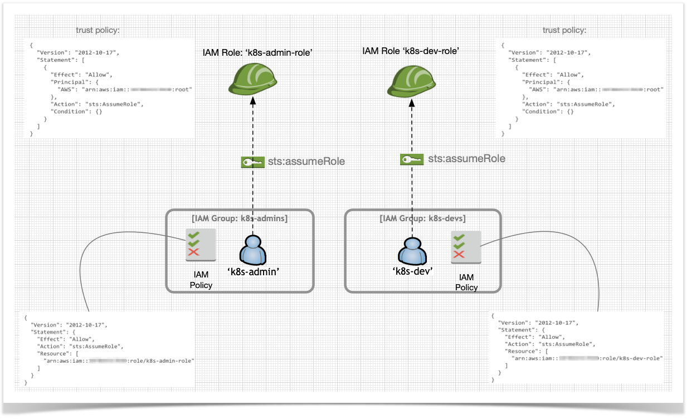
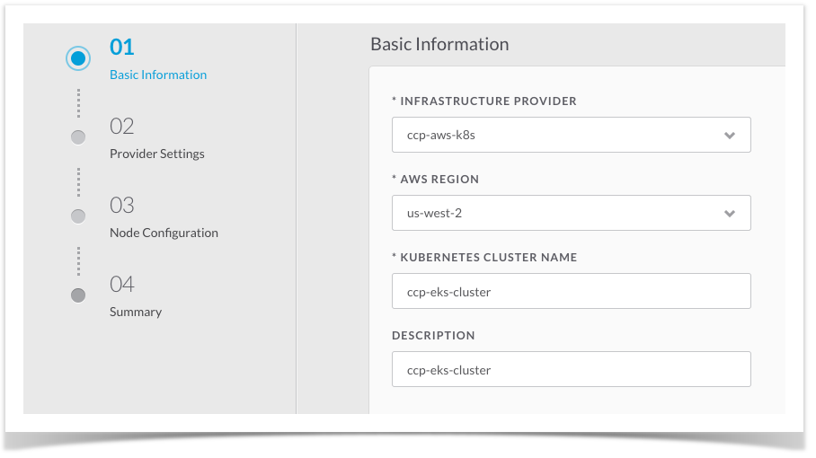
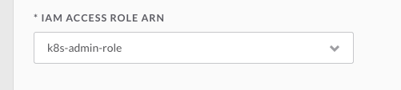
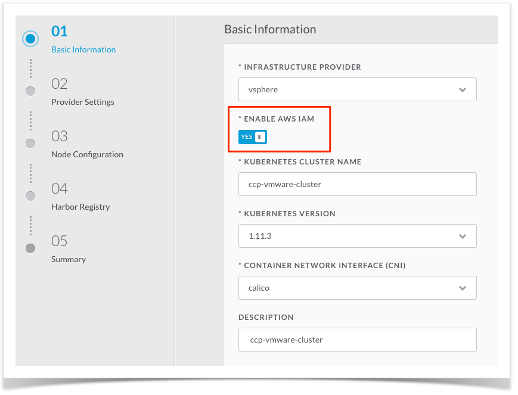
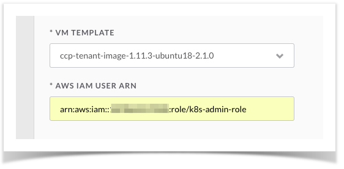
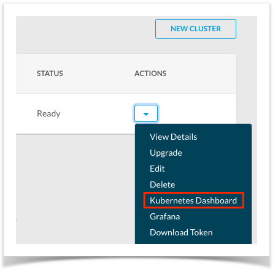
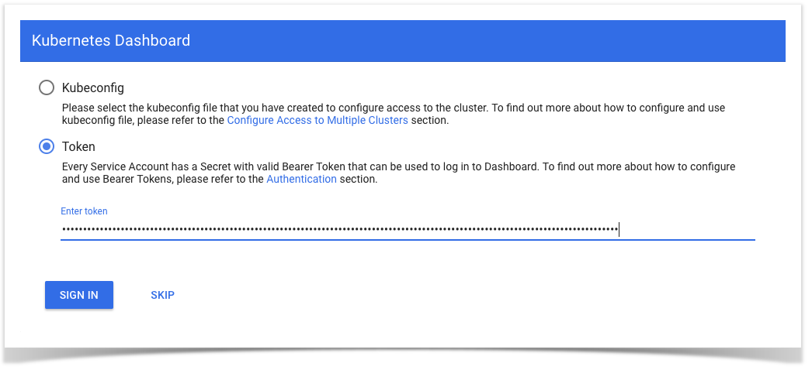
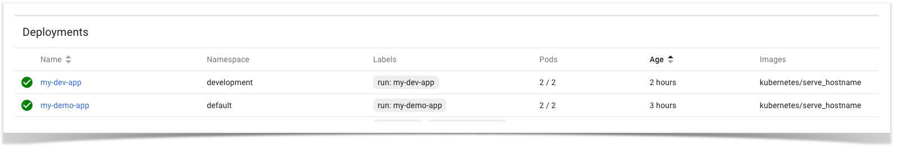

# Introduction
[aws-iam-authenticator](https://github.com/kubernetes-sigs/aws-iam-authenticator) is a utility that enables the use of AWS IAM identities/principals for authentication to Kubernetes clusters. By default, it is used by EKS to enable Kubernetes authentication via IAM and it is harnessed by CCP (Cisco Container Platform) to establish a consistent, unified identity scheme across both on-premise and AWS EKS clusters.

As outlined [here]:(https://github.com/kubernetes-sigs/aws-iam-authenticator)
"If you are an administrator running a Kubernetes cluster on AWS, you already need to manage AWS IAM credentials to provision and update the cluster. By using AWS IAM Authenticator for Kubernetes, you avoid having to manage a separate credential for Kubernetes access. AWS IAM also provides a number of nice properties such as an out of band audit trail (via CloudTrail) and 2FA/MFA enforcement."

Information on the use of MFA can be found [here](mfa-iam.md). Details on how to audit user authentications using CloudTrail can be found [here](audit-cloudtrail.md)

*aws-iam-authenticator* fulfills both a client and server function. On the client side, the authenticator's job is to generate, tokenise and transmit a pre-signed URL to the server-side for identity validation. The client is a Go binary, installed on your workstation, which is transparently invoked by kubectl each time you interact with your Kubernetes cluster. The 'server-side' is a containerised instance of aws-iam-authenticator running as a DaemonSet on the Kubernetes master nodes. This interacts with the AWS STS (Secure Token Service) to perform identity validation. CCP takes care of the initial server-side configuration as well as providing a pre-configured Kubeconfig file for admin users to download. Users simply need to ensure that the 'aws-iam-authenticator' is available within their $PATH while using kubectl to interact with clusters in the usual way. Installation instructions can be found here.

This post will outline how the authenticator interacts with AWS and maps IAM Roles to Kubernetes groups on both on-premise and EKS clusters. Implementation details concerning the initial setup, configuration, RBAC policy creation and basic validation will also be detailed.

Note: aws-iam-authenticator supports two additional authentication options: mapping individual **users** (e.g. arn:aws:iam::01234567890:user/Bob) and entire **AWS accounts** (e.g. 01234567890 ) to RBAC users. This post will focus on mapping **IAM roles** to Kubernetes groups. A sample config showing a userArn and Account mapping can be found [here](user-arn-mapping.yaml)

For a walk-through of the various interactions between *aws-iam-authenticator* and AWS IAM/STS, please view [this](iam-under-the-hood.md)

# AWS IAM Roles
Before going any further, let's ensure we have IAM roles configured in our AWS account. Note: other than a trust policy, these IAM roles do not require that any AWS policies/permissions are attached! They will be used purely to map external users to Kubernetes RBAC policies. Enterprise admins may have provisioned individual 'local' IAM users or may already be federating users from an existing Identity Provider via LDAP, ADFS, SAML or OIDC.

The example below shows two local IAM users, each of whom are members of a different IAM group. Each IAM group contains a simple IAM policy permitting its members to assume either the *k8s-dev-role* or *k8s-admin-role*. In this context, we can think of IAM roles as 'hats'. If I have been granted permission to assume the *k8s-admin-role* then I can wear the **admin** 'hat'. If I've also been granted permission to assume *k8s-dev-role* then I can wear the developer 'hat'. The trust policy, attached to the IAM role itself, could also be used to govern which users are permitted to assume the role. This trust policy could also be configured with additional conditions to e.g. permit cross-account access from 3rd party users, enforce MFA, restrict access based on source IP ranges and so on.



For an IAM tutorial that focuses on how federated Active Directory users can be logically grouped, here's a [useful post](https://aws.amazon.com/blogs/opensource/integrating-ldap-ad-users-kubernetes-rbac-aws-iam-authenticator-project/).

# Enabling Common Identity with CCP
Let's observe how easy it is to enable a common identity scheme on two Kubernetes clusters: one hosted on-premises (VMware) and another running in AWS (EKS). As we use the CCP UI to provision each cluster, we'll supply IAM Roles for both.

    Note: the use of IAM Authentication is implicitly enabled for EKS clusters.
    We'll show how CCP can map an additional, user supplied IAM role to the EKS
    cluster as well as configuring IAM auth for on-premises clusters.


As soon as both clusters have finished provisioning, we'll apply an identical RBAC policy to each before performing some final validation.

## EKS
Let's start with an EKS cluster. In CCP, we have already configured an Infrastructure Provider called 'ccp-aws-k8s' which contains our AWS Secret and Access API keys. todo: insert link to CCP docs outlining how this is done.


We proceed to create an EKS cluster by supplying some basic information:



On the next page, we are presented with the option to specify an IAM role (a drop-down list presents a list of IAM roles that exist within our account). For this example, we'll select a role from our account called *k8s-admin-role*



** ^todo: a JIRA case has been opened to permit free-text input of a role ARN (e.g. to facilitate x-account role assumption).**

By default, the AWS credentials specified at the time of Amazon EKS cluster creation (i.e the credentials configured in the Infrastructure Provider) will be mapped to the Kubernetes *cluster-admin* ClusterRole. A default ClusterRoleBinding binds this to the *system:masters* group, thereby granting super-user access to the holders of the IAM identity. As seen above, you can specify an additional AWS IAM role or IAM user which will also be granted administrative control of the cluster. Let's do this.


In our case, we have chosen to input the ARN for the *k8s-admin-role* IAM Role we created earlier. Later in this post, we'll also learn how to configure another mapping (using the ARN for our *k8s-dev-role*).


    Note: In the case where temporary credentials (i.e. via sts:AssumeRole) have
    been used to provision an EKS cluster, AWS will map the IAM role instead of
    the user ARN. A future version of CCP will permit the use of temporary
    credentials when configuring the Infrastructure Provider for AWS/EKS.


Lastly, we supply some final VPC configuration parameters before commencing cluster creation.


Once the cluster has been provisioned, we can download a pre-generated kubeconfig file which will enable access to our cluster:


    There are a variety of methods to help manage access to multiple clusters.
    These include the use of one or more kubeconfig files, switching contexts,
    leveraging kubectl flags and so on. Details [here](https://kubernetes.io/docs/tasks/access-application-cluster/configure-access-multiple-clusters/).

Now that our cluster has been provisioned, we can make a couple of observations. Firstly, in the 'users' stanza of the downloaded kubeconfig file we notice the following:

```
user:
    exec:
      apiVersion: client.authentication.k8s.io/v1alpha1
      command: aws-iam-authenticator
      args:
        - "token"
        - "-i"
        - "ccp-eks-cluster"
        - "-r"
        - "arn:aws:iam::1234567890:role/k8s-admin-role"
```

This will ensure that any user with permission to assume the the *k8s-admin-role* can administer the newly created cluster. Both *kubectl* and *aws-iam-authenticator* will automatically pick up AWS credentials from the usual places (~/.aws/credentials or from [AWS environment variables](https://docs.aws.amazon.com/cli/latest/userguide/cli-environment.html)).

In addition, it is possible to specify AWS environment variables in the 'env' sub-section of kubectl should this be desired:

```
user:
    exec:
      apiVersion: client.authentication.k8s.io/v1alpha1
      command: aws-iam-authenticator
      args:
        - "token"
        - "-i"
        - "ccp-eks-cluster"
        - "-r"
        - "arn:aws:iam::1234567890:role/k8s-admin-role"
	  env:
      - name: AWS_PROFILE
        value: my-prod-account
```

Using the AWS credentials for the *k8s-admin* IAM user, let's perform a basic check to ensure we can interact with the newly created EKS cluster using the newly downloaded kubeconfig file:

```
➜  ~ kubectl get nodes --kubeconfig=$HOME/Downloads/ccp-eks-cluster.env
NAME                                       STATUS   ROLES    AGE   VERSION
ip-10-0-3-120.us-west-2.compute.internal   Ready    <none>   18h   v1.10.3
ip-10-0-5-217.us-west-2.compute.internal   Ready    <none>   18h   v1.10.3
```

The second thing we can observe is the entry that CCP has included in the *aws-auth* configMap. This inclusion enables us to use our IAM role to authenticate to the cluster:

```
➜  ~ kubectl describe cm aws-auth --kubeconfig=$HOME/Downloads/ccp-eks-cluster.env -n kube-system

...

mapRoles:
----
- rolearn: arn:aws:iam::1234567890:role/k8s-admin-role
  username: k8s-admin-user:{{SessionName}}
  groups:
  - system:masters
```

**Summary**

Authentication to our EKS cluster using a common IAM identity has succeeded because:

* the *k8s-admin* user has permission to assume the IAM role: *"arn:aws:iam::1234567890:role/k8s-admin-role"*;
* the IAM role: *"arn:aws:iam::1234567890:role/k8s-admin-role"* has been mapped, by CCP, to the Kubernetes *system:masters* group;
* CCP has configured the kubeconfig file with the ARN of our IAM role which is used by *aws-iam-authenticator* to validate our identity;  


## On-Premises/VMware
As with an EKS cluster provisioned by CCP, we'll now observe how on-premises Kubernetes clusters can avail of the same integrated authentication experience with AWS IAM. When provisioning on-premises clusters, we select the **ENABLE AWS IAM** option. This will install the AWS IAM authenticator on the newly created on-premises master nodes. This allows us to use the same set of AWS IAM credentials to access on-premises and AWS hosted Kubernetes clusters.


Let's take a closer look by using CCP to provision an on-premises cluster on VMware. For instructions on how to configure the VMware Infrastructure Provider please review this  **todo: insert CCP documentation link.**


We start by providing some basic information and toggling the 'ENABLE AWS IAM' button to 'YES'



On the next page, we are prompted to input a number of provider settings as well as the ARN for the IAM role we wish to use.

We don't want to manage a separate pool of users for our on-premises cluster, so we'll specify the very same IAM role ARN we used in the EKS cluster creation process:



Once CCP has finished the provisioning process, we download the kubeconfig file for the on-premises cluster:


As we've already done for our EKS cluster, let's quickly validate that the kubeconfig file for our on-premises cluster has been configured by CCP to include an entry for the IAM role we specified during cluster creation:

```
user:
   exec:
     apiVersion: client.authentication.k8s.io/v1alpha1
     command: aws-iam-authenticator
     args:
       - "token"
       - "-i"
       - "ccp-vmware-cluster"
       - "-r"
       - "arn:aws:iam::1234567890:role/k8s-admin-role"
```

As we can see above, this is identical to the stanza used in the kubeconfig we downloaded earlier for the EKS cluster.

Next, let's ensure we can use this kubeconfig to interact with our on-premises cluster:

```
➜  ~ kubectl get nodes --kubeconfig=$HOME/Downloads/d64c2b9f-4bbe-441e-90de-a44c35d7798c.env
NAME                                  STATUS   ROLES    AGE   VERSION
ccp-vmware-cluster-mastere208a6a355   Ready    master   43m   v1.11.3
ccp-vmware-cluster-worker27aa717613   Ready    <none>   42m   v1.11.3
ccp-vmware-cluster-worker6686022590   Ready    <none>   42m   v1.11.3
```

Finally, let's take a look at the configMap that CCP has provisioned for our on-premises cluster:

```
➜  ~ kubectl describe cm aws-iam-authenticator --kubeconfig=$HOME/Downloads/d64c2b9f-4bbe-441e-90de-a44c35d7798c.env -n kube-system


mapRoles:
  - roleARN: arn:aws:iam::1234567890:role/k8s-admin-role
    username: kubernetes-admin-user:{{SessionName}}
    groups:
    - system:masters
```

From the above output, we see that an identical configMap entry has been configured by CCP for this cluster thereby enabling authentication to both on-premises and AWS hosted Kubernetes clusters using the same IAM identity.

**Summary**
As was the case for EKS, authentication to our on-premises cluster using a common IAM identity has succeeded because:

* the *k8s-admin* user has permission to assume the IAM role: *"arn:aws:iam::1234567890:role/k8s-admin-role"*;
* the role: *"arn:aws:iam::1234567890:role/k8s-admin-role"* has been mapped, by CCP, to the Kubernetes *system:masters* group;
* CCP has configured the kubeconfig file with the ARN of our IAM role which is used by *aws-iam-authenticator* to validate our identity;


# Configuring Common RBAC Policies (EKS & on-premises)
Now that we've verified that IAM has been configured on both clusters for admin users, we turn our attention towards defining an RBAC policy for non-admin users. These will be users of the IAM group *k8s-devs* who have been granted permission to assume the IAM role *k8s-dev-role*.


On each of our newly provisioned EKS and on-premises clusters we'll:

* create a *development* namespace;
* create a Role called *dev-role* whose permissions are scoped to the *development* namespace;
* create a RoleBinding to grant the *dev-role* to a Kubernetes group called *k8s-developers*;


The following manifest can be used to achieve this:

```
# ccp-rbac.yaml
# Grant developers full access to the "development" namespace only.
---
apiVersion: v1
kind: Namespace
metadata:
  name: development
spec:
  finalizers:
  - kubernetes
---
kind: Role
apiVersion: rbac.authorization.k8s.io/v1
metadata:
  namespace: development
  name: dev-role
rules:
- apiGroups: ["*"]
  resources: ["*"]
  verbs: ["*"]
---
kind: RoleBinding
apiVersion: rbac.authorization.k8s.io/v1
metadata:
  name: dev-role-binding
  namespace: development
subjects:
  - kind: Group
    name: k8s-developers
    apiGroup: rbac.authorization.k8s.io
roleRef:
  kind: Role
  name: dev-role
  apiGroup: rbac.authorization.k8s.io
```

We apply this to both clusters:

```
➜  ~ kubectl apply -f ccp-rbac.yaml --kubeconfig=$HOME/Downloads/d64c2b9f-4bbe-441e-90de-a44c35d7798c.env
namespace/development created
role.rbac.authorization.k8s.io/dev-role created
rolebinding.rbac.authorization.k8s.io/dev-role-binding created

➜  ~ kubectl apply -f ccp-rbac.yaml --kubeconfig=$HOME/Downloads/ccp-eks-cluster.env
namespace/development created
role.rbac.authorization.k8s.io/dev-role created
rolebinding.rbac.authorization.k8s.io/dev-role-binding created
```

Next, we create a new entry in the authenticator configMap on both clusters with the ARN of our developer IAM role:

```
- rolearn: arn:aws:iam::1234567890:role/k8s-dev-role
  username: k8s-dev-user:{{SessionName}}
  groups:
  - k8s-developers
```

    Note: "{{SessionName}}" will be interpolated to an alphanumeric string of
    characters which can be used to uniquely identify the session/principal who
    has assumed the IAM role. This gets logged in AWS CloudTrail and the
    'aws-iam-authenticator' pod logs.

We can copy the above entry and paste it into the the configMap on both clusters via:

```
➜  ~ kubectl edit cm aws-auth --kubeconfig=$HOME/Downloads/ccp-eks-cluster.env -n kube-system
configmap/aws-auth edited


➜  ~ kubectl edit cm aws-iam-authenticator --kubeconfig $HOME/Downloads/d64c2b9f-4bbe-441e-90de-a44c35d7798c.env -n kube-system
configmap/aws-iam-authenticator edited
```

Finally, the *aws-iam-authenticator* pod(s) running in our **on-premises** cluster require a restart in order to pick up the configMap change. In a future release of *aws-iam-authenticator*, this won't be necessary. This pod restart is also not necessary on the EKS cluster.


To find the authenticator pod(s) we need to restart, perform the following (note: there will be one pod per master node) and look for *aws-iam-authenticator-xxxx*:

```
➜  ~ kubectl get pods -n kube-system --kubeconfig $HOME/Downloads/d64c2b9f-4bbe-441e-90de-a44c35d7798c.env


NAME                                   READY   STATUS    RESTARTS   AGE
aws-iam-authenticator-bqszk            1/1     Running   0          13m
calico-node-4ds7m                      2/2     Running   0          1d
calico-node-xj6s8                      2/2     Running   0          1d
...
...
```

Next, we perform the following on each authenticator pod, waiting a few seconds between each delete command. Replacement pod(s) will be immediately created.

```
➜  ~ kubectl delete pods aws-iam-authenticator-bqszk -n kube-system --kubeconfig ~/Downloads/d64c2b9f-4bbe-441e-90de-a44c35d7798c.env
```

We've now successfully enabled IAM authentication for our developer team on both an EKS and on-premises cluster as well as defining a common RBAC policy. Using a single IAM identity, it will now be possible for our user *dev-k8s* to utilise the *developer* namespace on each cluster.

Let's validate that everything works.

# RBAC Validation
After both our EKS and on-premises clusters were created, we saw that CCP had already configured *aws-iam-authenticator* to map our admin IAM role to the *system:masters* Kubernetes group. This granted cluster wide super-user privileges to users who assumed the *k8s-admin-role*.

When the cluster provisioning process completed, we then configured IAM authentication and a common RBAC policy on both clusters for another segment of users: **developers**.


To validate that our simple RBAC policy is working as expected on both clusters, we'll be attempting the following:

* as an admin user, we'll attempt to deploy a sample application to the *default* namespace;
* as a developer, we'll attempt to query the pods that have been recently deployed to the *default* namespace in step 1.;
* as a developer, we'll attempt to deploy a sample application in the *default* namespace;
* as a developer, we'll attempt to deploy a sample application to the *developer* namespace;

## Admin: App Deployment (default namespace)
As an admin, we'll deploy a sample application to the **default** namespace on both clusters:

```
➜  ~ kubectl run my-demo-app --image=kubernetes/serve_hostname --replicas=2 -n default --kubeconfig ~/Downloads/ccp-eks-cluster.env
deployment.apps/my-demo-app created


➜  ~ kubectl run my-demo-app --image=kubernetes/serve_hostname --replicas=2 -n default --kubeconfig ~/Downloads/d64c2b9f-4bbe-441e-90de-a44c35d7798c.env
deployment.apps/my-demo-app created
```

We observe that this succeeds because:

1. we have AWS credentials for the *k8s-admin* user;

2. the *k8s-admin* user has permission to assume the *k8s-admin* IAM role;

3. our kubeconfig file has been pre-configured by CCP to invoke *aws-iam-authenticator* with the ARN of the *k8s-admin* IAM role;

4. CCP has configured both clusters with a mapping statement that grants admin users with cluster-wide super-user privileges (*system:masters*);


### Developer: App Deployment (default namespace)

Next, as a developer, we'll attempt to deploy a sample application to the **default** namespace.


    Note: to this point, we've been using AWS IAM credentials for the k8s-admin user
    and the kubeconfig files we downloaded for the EKS and on-premises cluster
    have contained the ARN for the k8s-admin IAM role.

### Initial Developer Setup

Let's create a named AWS profile for the developer user.


In *~/.aws/credentials* we place the secret and access keys for our developer. Alternatively, [AWS environment variables](https://docs.aws.amazon.com/cli/latest/userguide/cli-environment.html) could be used.

```
[k8s-dev]
aws_access_key_id = ABCDEFGHIJQLMNOP
aws_secret_access_key = supersecretaccesskeyfordevuser
```

Next, we create a kubeconfig file for the developer user. Most of the existing config can be reused so we'll just create new copies and make minor changes. Alternatively, the existing kubeconfig file could be amended with multiple additional contexts.

```
cp ~/Downloads/ccp-eks-cluster.env ~/Downloads/ccp-eks-dev.env


cp ~/Downloads/d64c2b9f-4bbe-441e-90de-a44c35d7798c.env ~/Downloads/ccp-onprem-dev.env
```

In each of the two new kubeconfig files, we make two changes to the following stanza:

**Before:**

```
user:
    exec:
      apiVersion: client.authentication.k8s.io/v1alpha1
      command: aws-iam-authenticator
      args:
        - "token"
        - "-i"
        - "ccp-eks-cluster"
        - "-r"
        - "arn:aws:iam::<AWS_ACCOUNT_ID>:role/k8s-admin-role"
```

**After:**

```
user:
    exec:
      apiVersion: client.authentication.k8s.io/v1alpha1
      command: aws-iam-authenticator
      args:
        - "token"
        - "-i"
        - "ccp-eks-cluster"
        - "-r"
        - "arn:aws:iam::1234567890:role/k8s-dev-role"
      env:
      - name: "AWS_PROFILE"
        value: "k8s-dev"
```

We have now specified the ARN for the *k8s-dev-role* IAM role in our kubeconfig file and have set the *AWS_PROFILE* environment variable to use our new developer credentials.


Wearing our **developer** hat, we're now ready to see if we can retrieve information about the pods that were deployed by the **admin** user.


On the EKS and on-premises clusters, we perform the following:

```
➜  ~ kubectl get pods --kubeconfig ~/Downloads/ccp-onprem-dev.env
Error from server (Forbidden): pods is forbidden: User "k8s-dev-user:1541763746934563752" cannot list pods in the namespace "default"


➜  ~ kubectl get pods --kubeconfig ~/Downloads/ccp-eks-dev.env
Error from server (Forbidden): pods is forbidden: User "k8s-dev-user:1541764208926713353" cannot list pods in the namespace "default"
```

This fails because the common RBAC policy we created for developers doesn't confer read permissions on the **default** namespace. Similarly, if we attempt to **deploy** a sample application to each cluster's default namespace we'll observe similar:

```

➜  ~ kubectl run my-dev-app --image=kubernetes/serve_hostname --replicas=2 -n default --kubeconfig ~/Downloads/ccp-onprem-dev.env
Error from server (Forbidden): deployments.apps is forbidden: User "k8s-dev-user:1541764556226530325" cannot create deployments.apps in the namespace "default"


➜  ~ kubectl run my-dev-app --image=kubernetes/serve_hostname --replicas=2 -n default --kubeconfig ~/Downloads/ccp-eks-dev.env
Error from server (Forbidden): deployments.apps is forbidden: User "k8s-dev-user:1541764626576359929" cannot create deployments.apps in the namespace "default"
```

Finally, let's attempt to deploy the app in the **development** namespace this time:

```
➜  ~ kubectl run my-dev-app --image=kubernetes/serve_hostname --replicas=2 --kubeconfig ~/Downloads/ccp-onprem-dev.env -n development
deployment.apps/my-dev-app created


➜  ~ kubectl run my-dev-app --image=kubernetes/serve_hostname --replicas=2 --kubeconfig ~/Downloads/ccp-eks-dev.env -n development
deployment.apps/my-dev-app created
```

This works, but let's run one final verification check that app deployment has succeeded on the EKS and on-premises clusters:

```
➜  ~ kubectl get pods --kubeconfig ~/Downloads/ccp-onprem-dev.env -n development

NAME                          READY   STATUS    RESTARTS   AGE
my-dev-app-5d5bcc69fd-7tsvh   1/1     Running   0          3m
my-dev-app-5d5bcc69fd-qcplm   1/1     Running   0          3m


➜  ~ kubectl get pods --kubeconfig ~/Downloads/ccp-eks-dev.env -n development

NAME                          READY   STATUS    RESTARTS   AGE
my-dev-app-547d4dfcf5-fqsnw   1/1     Running   0          2m
my-dev-app-547d4dfcf5-hldpn   1/1     Running   0          2m
```

## Summary
We have seen how, during the cluster creation process, CCP automatically mapped a common IAM identity of our choosing to the *system:masters* group on an on-premises and EKS hosted Kubernetes cluster. This granted cluster-wide superuser privileges to our *k8s-admin* IAM user who had been provisioned, in AWS, with permission to assume a specific IAM role.


Post cluster creation, we enabled IAM authentication for another population of users: *developers*. To achieve this, using identical configs, we updated a configMap on each cluster with a new IAM Role ARN before applying a single Kubernetes manifest that reflected our desired RBAC policy.

We then carried out some validation steps to ensure that our RBAC policy worked as expected and was consistently applied across the CCP provisioned on-premises and EKS clusters.


    Note: Enabling access for additional users requires no subsequent Kubernetes
    configuration! Rather, it merely requires that those additional users are
    provisioned with permission to assume the appropriate IAM role in AWS.


# Accessing the K8s Dashboard with IAM tokens
Finally, we'll generate a token for use in gaining authenticated access to the Kubernetes Dashboard on an on-premises cluster. Once authenticated, we should be able to see the apps we recently deployed in the default and development namespaces.


The IAM token will be generated with *aws-iam-authenticator* using the **admin** IAM Role.


In *~/.aws/credentials* there is a named profile called *k8s-admin* which contains our user credentials needed to assume the *k8s-admin-role*.

```
[k8s-admin]
aws_access_key_id = ABCDEFGHI1234
aws_secret_access_key = supersecretawsacccesskey
```

To generate a token using the *k8s-admin-role*, we can perform the following:

```
AWS_PROFILE=k8s-admin aws-iam-authenticator -i ccp-vmware-cluster token --token-only -r arn:aws:iam::1234567890:role/k8s-admin-role | pbcopy
```

The Kubernetes dashboard can be accessed via the cluster 'Actions' drop-down in CCP:



The token, which is valid for 15 minutes, can then be pasted into the Dashboard as follows:



Once we've used our token to authenticate, we'll see the recent app deployments made by the *admin* and *developer* users in the *default* and *developer* namespaces:


