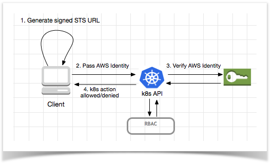

# Under the hood
The following sections will explain, in some more detail, how the interactions between *aws-iam-authenticator* and AWS IAM are carried out. In addition, we'll show how *aws-iam-authenticator* can be used to manually generate and validate tokens.

# Pre-signed URL Generation (Client-side)

One of the most common use-cases for creating 'pre-signed' AWS URLs is to provide temporary, time-bound access to S3 objects but they can be used for other purposes also.

It is important to note that a pre-signed URL can pass all request values, parameters and signing information in the request. It is a little like a pre-paid gift-voucher in the sense that it is a fully authenticated, signed URL loaded with everything needed to execute a successful AWS API call by a 3rd party. As such, we need to ensure that the pre-signed URL is:

* treated as sensitively as a credential, and
* bound with a short expiration time (implemented via the *'X-Amz-Expires'* header);


Thankfully, this is taken care of for us. In our case, the client-side authenticator generates a signed URL for the AWS 'STS' (secure token service). Specifically, it is crafting a pre-approved, signed URL (with all parameters include in the query string) for the AWS *sts:GetCallerIdentity* endpoint which, when called, will return details about the AWS principle/role that was used to create the URL. This signed URL is then serialised (base64 encoded) into a token and transmitted to the k8s authC system (step 2 in diagram below) for validation.


    As with all AWS interactions, authentication can be
    achieved via the use of standard credentials (keys) or by
    calling STS:assumeRole with both credentials and a
    specified IAM role.


When using local, static AWS credentials the authenticator generates and signs the URL locally. *No* interaction with AWS is required by the client:



When using temporary credentials, as requested via an *sts:AssumeRole* API call, then an initial interaction with AWS is necessary in order to generate a signed URL (per step #1 in diagram below).


    Note: when using temporary credentials, the URL generated by
    the authenticator will contain an additional query parameter:
    *'X-Amz-Security-Token'* whose value will be the URI encoded
    SessionToken returned by STS.


# Log Inspection & Token Generation
To inspect a pre-signed URL generated by *aws-iam-authenticator*, we can manually generate and decode a token as follows (note: in this approach we are using temporary credentials via *sts:AssumeRole* to create the token):

```
AWS_REGION=us-west-2 AWS_PROFILE=eks-dev-user aws-iam-authenticator token -i obyrne-k8s -r arn:aws:iam::<AWS_ACCOUNT_ID>:role/eks-dev-assume-role --token-only | sed 's/k8s-aws-v1\.//' | base64 --decode
```

which yields the following:


In CloudTrail, we can see the temporary credentials returned via the initial STS call. Note how the *sessionToken* is mapped to *X-Amz-Security-Token* parameter above.


Upon successfully signing into the k8s dashboard with an IAM token, we should see a log entry similar to this:

```

time="2018-11-09T10:33:41Z" level=info msg="access granted" arn="arn:aws:iam::<AWS_ACCOUNT_ID>:user/obyrne" client="127.0.0.1:42114" groups="[system:masters]" method=POST path=/authenticate uid="heptio-authenticator-aws:<AWS_ACCOUNT_ID>:AIDAJBOFDYON4XIJ5RWC2" username=aws

```

# Server side (aws-iam-authenticator server)
*"The token is passed through the Kubernetes API server and into the Authenticator server's /authenticate endpoint via a webhook configuration. The Authenticator server validates all the parameters of the pre-signed request to make sure nothing looks funny. It then submits the request to the real https://sts.amazonaws.com server, which validates the client's HMAC signature and returns information about the user. Now that the server knows the AWS identity of the client, it translates this identity into a Kubernetes user and groups via a simple static mapping."*


    this section is incomplete


# References:
https://github.com/kubernetes-sigs/aws-iam-authenticator

https://docs.aws.amazon.com/STS/latest/APIReference/API_GetCallerIdentity.html

[Proposal to use CRDs instead of ConfigMap](https://docs.google.com/document/d/1UgSDcMbZdMXLY1SxUtQ7r1puLFdGYF660usGW7AlGwE/edit#heading=h.pyidw1yq3itp)

[k8s - webhook mode](https://kubernetes.io/docs/reference/access-authn-authz/webhook/)
