# Hybrid Cloud - DMVPN Network Deployment (Single Router Model - FOR POC ONLY)

## Table of Contents
[Introduction](#introduction)

[Prerequisites](#prerequisites)

[Reference Topology](#reference-topology)

[AWS DMVPN Network Deployment](#aws-dmvpn-network-deployment)

[Enterprise DMVPN Network Deployment](#enterprise-dmvpn-network-deployment)

[Summary](#summary)

[Reference Information](#reference-information)

## Introduction

The following documentation provides guidance for a Hybrid Cloud network deployment between Amazon Web Services (AWS) and an Enterprise site using the [Cisco Cloud Services Router 1000v Series (CSR1000v)](https://www.cisco.com/c/en/us/products/routers/cloud-services-router-1000v-series/index.html), the [Cisco Aggregation Service Router 1000 (ASR1000)](https://www.cisco.com/c/en/us/products/routers/asr-1000-series-aggregation-services-routers/index.html),  and [Dynamic Multipoint Virtual Private Network (DMVPN)](https://www.cisco.com/c/en/us/products/security/dynamic-multipoint-vpn-dmvpn/index.html). The use case leverages the [Cisco Container Platform](https://www.cisco.com/c/en/us/products/cloud-systems-management/container-platform/index.html) and its automated deployment of an Enterprise on-premises [Kubernetes](https://kubernetes.io/) cluster, an automated deployment of an [Elastic Container Service for Kubernetes Service (EKS)](https://aws.amazon.com/eks/) cluster and an [Elastic Container Registry (ECR)](https://aws.amazon.com/ecr/) repository at [Amazon Web Services (AWS)](https://aws.amazon.com/).

If you are looking for documentation on an Internet Over-the-Top (OTT) network deployment (not IPsec-based), please refer to the [Hybrid Cloud - Internet Over-the-Top Network Deployment](https://wwwin-github.cisco.com/CPSG/multicloud/blob/master/aws/public/docs/network/ott/README.md) document. <**: Insert FINAL document link here**>

**Note:** This document does not provide an introduction to DMVPN. See the [Prerequisites](#prerequisites) section below on references for learning more about DMVPN and how to deploy it.

The DMVPN network deployment leverages existing public Internet connectivity between an Enterprise Data Center and AWS and establishes an encrypted [IPsec](https://www.cisco.com/c/en/us/products/ios-nx-os-software/ios-ipsec/index.html) connection between Cisco IOS routers located at the Enterprise Data Center and one or more Cisco CSR 1000v virtual routers at AWS. Enterprise on-premises workloads running on the Cisco Container Platform that need to connect to Amazon public service endpoints will traverse the Enterprise/Internet Edge tier (public Internet connection) and connect to the public Amazon service endpoints which include, but are not limited to:
* [Amazon Elastic Compute Service (EC2)](https://aws.amazon.com/ec2/)
* [Amazon Virtual Private Cloud (VPC)](https://aws.amazon.com/vpc/)
* [Amazon Elastic Container Service for Kubernetes (EKS)](https://aws.amazon.com/eks/)
* [Amazon Elastic Container Registry (ECR)](https://aws.amazon.com/ecr/)

Workload connectivity between the Enterprise on-premises Cisco Container Platform cluster(s) and the Amazon EKS worker nodes will traverse the encrypted DMVPN connection between the AWS-hosted Cisco CSR 1000v and the Enterprise on-premises Cisco IOS routers (e.g., [Cisco Aggregation Service Router 1000 (ASR1000)](https://www.cisco.com/c/en/us/products/routers/asr-1000-series-aggregation-services-routers/index.html) or similar).

For non-DMVPN encrypted traffic, there are a couple of options in an AWS environment for how Amazon EC2 instances (to include the EKS worker nodes) access public Internet networks outside of AWS and how resources access Amazon EC2 instances from Internet networks outside of AWS. Again, these options are not used for traffic being routed through the DMVPN connection:

* [Network Address Translation (NAT) Gateway](https://docs.aws.amazon.com/vpc/latest/userguide/vpc-nat-gateway.html) - EKS worker nodes will use an Amazon NAT Gateway as their default gateway for Internet-facing connectivity.  **Note:** It is up to the developer or operations team to deploy an Amazon EC2 Linux Bastion/jump host so that secure external connectivity into the VPC and the various Amazon EC2 nodes (to include the EKS worker nodes) can take place. This document does not provide guidance on how to deploy the Linux Bastion host, but Amazon does provide a reference deployment for [Linux Bastion Hosts on AWS](https://docs.aws.amazon.com/quickstart/latest/linux-bastion/architecture.html) which includes an [Amazon CloudFormation](https://aws.amazon.com/cloudformation/) [Quick Start Launcher](https://docs.aws.amazon.com/quickstart/latest/linux-bastion/welcome.html).
* [Elastic IP (EIP)](https://docs.aws.amazon.com/AWSEC2/latest/UserGuide/elastic-ip-addresses-eip.html) - EKS worker nodes are assigned an EIP that is used for outbound connectivity through an [Amazon VPC Internet Gateway (igw)](https://docs.aws.amazon.com/vpc/latest/userguide/VPC_Internet_Gateway.html). In addition to outbound Internet access, conditionally, the Enterprise security policy may allow for limited access (e.g., SSH access) to each EKS worker node via direct access through the publically routable EIP.

**Note:** The Enterprise Cloud and network security team and their policies mandate which of these two options are used, if at all. It is common practice for Enterprise security policies to force all traffic to/from Amazon EC2 instances through the encrypted DMVPN connection. In this document, the NAT Gateway model is used and only for non-Kubernetes workload traffic that is destined to the Internet. The EIP model is not discussed for EKS worker nodes, but an EIP is assigned to the Cisco CSR 1000v router so that it has public Internet access for the DMVPN connection. Additionally, it is up to the Enterprise application/service admin as well as the Cloud and network security team to determine if a Cisco Container Platform-hosted microservice or Amazon EKS microservice will be reachable via a public IP endpoint (e.g., Load-balancer Virtual IP [VIP]). In this document, the assumption is made that all Cisco Container Platform-hosted microservices and Amazon EKS microservices are available only through the encrypted DMVPN connection.

**Figure 1** below is a high-level diagram of the overall DMVPN network deployment.

**Figure 1. AWS VPC, Subnet, EKS, ECR, and Cisco Container Platform Topology Overview**

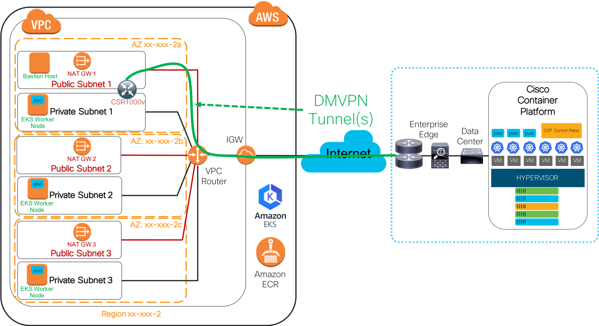

In **Figure 1** shown above, The Cisco Container Platform is deployed at the Enterprise Data Center located on the right side of the diagram. At the time of writing this documentation, the Cisco Container Platform is deployed in virtual machines (VMs) that are hosted on a VMware vSphere environment.  For the sake of the DMVPN network deployment, it does not matter how the Cisco Container Platform connects to the Internet. Just so outbound Internet connectivity to the Amazon service endpoints is allowed for the relevant destination IPs (based on Amazon region) and the service endpoint ports (e.g., TCP port 443), then the solution will work. In this example, the Cisco Container Platform connects to the Data Center which is then connected to the Enterprise/Internet Edge. Again, for the sake of the DMVPN network deployment example, the exact products, solutions, and network design do not matter just so that outbound connectivity is allowed from the Cisco Container Platform to the relevant Amazon service endpoints for non-Kubernetes workload traffic.

On the left side of the diagram is the Amazon high-level topology. The Cisco Container Platform automation creates a VPC at AWS within a defined region. The Cisco Container Platform creates an Internet Gateway (IGW) and at least six subnets in the VPC. Three subnets are used for 'public' (e.g., Internet) access and three or more subnets are used as 'private' subnets by each of the EKS worker nodes.  For availability purposes, a public and private subnet are assigned to each of the three AZs shown. In this use case, each public subnet will have a NAT Gateway attached and, optionally (but shown), one or more Linux Bastion/jump hosts. The NAT Gateway is used for outbound Internet access by the EKS worker nodes (and any other EC2 instance that does not have an EIP assigned). In this use case, the EKS worker nodes use the NAT Gateway as their default gateway out to the Internet. The example topology indicates that one EKS worker node is attached to each [Availability Zone (AZ)](https://docs.aws.amazon.com/AWSEC2/latest/UserGuide/using-regions-availability-zones.html) in the region.

**Note:** NAT Gateways are highly available within an AZ, but if additional high availability is needed for the NAT Gateways in the event of a subnet or AZ failure then you can modify the private route table(s) and set the Target to a functional NAT Gateway. Amazon provides documentation and a basic NAT monitoring script that can be modified to allow for each NAT Gateway to monitor each other and in the event that the subnet or AZ that the NAT Gateway is located in goes down, private subnet route tables will be updated so that instances can use another NAT Gateway in another AZ.  The following documentation is focused on NAT Instances, but can be modified to be used for NAT Gateways. Refer to the [High Availability for Amazon VPC NAT Instances](https://aws.amazon.com/articles/high-availability-for-amazon-vpc-nat-instances-an-example/)

 Additionally, in the diagram, the Amazon EKS control plane cluster and Amazon ECR services are shown. Connectivity to the Amazon EKS control plane cluster and the Amazon ECR service by the Cisco Container Platform occur through the regional Amazon public endpoint for each of those services (EKS/ECR).

 In **Figure 1**, the DMVPN-specific components include one or more Cisco IOS routers at each site (Enterprise and AWS) that has DMVPN support. Please refer to the following Cisco DMVPN hardware data sheet for supported platforms: [https://www.cisco.com/c/en/us/products/collateral/security/dynamic-multipoint-vpn-dmvpn/data_sheet_c78-468520.html](https://www.cisco.com/c/en/us/products/collateral/security/dynamic-multipoint-vpn-dmvpn/data_sheet_c78-468520.html). For Cisco CSR1000v software router support for DMVPN: [https://www.cisco.com/c/en/us/products/collateral/routers/cloud-services-router-1000v-series/datasheet-c78-733443.html](https://www.cisco.com/c/en/us/products/collateral/routers/cloud-services-router-1000v-series/datasheet-c78-733443.html). In **Figure 1**, at the Enterprise site, the Cisco ASR 1000 series router is used as the DMVPN 'Hub' router and at the AWS VPC region, a Cisco CSR 1000v is used as a DMVPN 'Spoke' router.  A redundant DMVPN connection exists (indicated by the green line) between the single Cisco CSR 1000v router at AWS and the Enterprise Cisco ASR 1000(s). The Cisco CSR 1000v at AWS has one interface in a public subnet and one interface in a private subnet. On the public-facing interface, the Cisco CSR 1000v EC2 instance has an Elastic IP associated with the network interface. This EIP is used for outbound connectivity to the Internet and inbound connectivity from the Enterprise-side public IPv4 addresses on the Cisco ASR 1000 series routers.

 This document is not meant to educate you on all of the possible recommended design and deployment best practices for DMVPN, but it is meant to provide a single practical example and walk-through of the topology and example configuration so that you have an understanding of the traffic flow from one side to the other. This walk-through will help you when you deploy a new or use an existing Hybrid Cloud deployment where workloads at either site need to communicate with one another over a DMVPN deployment. There are many design and deployment options available for deploying the Cisco CSR 1000v at AWS. The following guides can be used to deploy a Cisco CSR 1000v in a single or high-availability design:

Amazon Web Services - Cisco CSR 1000v Documentation:
 * [AWS Marketplace: Cisco CSR 1000v Search Results](https://aws.amazon.com/marketplace/search/results?x=0&y=0&searchTerms=cisco+csr+1000v&page=1&ref_=nav_search_box)
 * [AWS Automated Transit VPC Deploying using Cisco CSR 1000v](https://docs.aws.amazon.com/solutions/latest/cisco-based-transit-vpc/deployment.html)
 * [Understanding the AWS Transit Network VPC with Cisco CSR 1000v](https://docs.aws.amazon.com/solutions/latest/cisco-based-transit-vpc/overview.html)

Cisco - Cisco CSR 1000v Documentation:  <**: Insert NEW CLOUD CONNECT documents here**>
 * [New Guide! - Cisco Multicloud Portfolio: Cloud Connect Design Considerations and Overview](https://www.cisco.com/c/en/us/solutions/collateral/cloud/guide-c07-741193.html)
 * [New Guide! - Cisco Multicloud Portfolio: Cloud Connect AWS Transit VPC with Cisco CSR 1000V](https://www.cisco.com/c/en/us/products/collateral/routers/cloud-services-router-1000v-series/guide-c07-740270.html)
 * [Cisco CSR 1000v Deployment Guide for AWS](https://www.cisco.com/c/en/us/td/docs/routers/csr1000/software/aws/b_csraws.html)
 * [Cisco CSR 1000v Transit VPC Deployment Guide](https://www.cisco.com/c/en/us/td/docs/routers/csr1000/software/aws/b_csraws_transitVPC.html)

Cisco - Cisco Design and Deployment Guide for AWS VPN to Cisco ASR 1000 Router:
 * [New Guide! - Cisco Multicloud Portfolio: Cloud Connect Design and Deployment Guide for Private Data Center to AWS VPC](https://www.cisco.com/c/en/us/products/collateral/security/cloud-access-security/guide-c07-740253.html)

 ## Prerequisites

The following items are considered prerequisites for the DMVPN network deployment discussed in this document:

**IPsec/DMVPN**:
  * A detailed understanding of how DMVPN works and how it is deployed:
    * [Dynamic Multipoint Virtual Private Network (DMVPN)](https://www.cisco.com/c/en/us/products/security/dynamic-multipoint-vpn-dmvpn/index.html)
    * [DMVPN Configuration Guide, Cisco IOS-XE Fuji 16.9.x](https://www.cisco.com/c/en/us/td/docs/ios-xml/ios/sec_conn_dmvpn/configuration/xe-16-9/sec-conn-dmvpn-xe-16-9-book.html)
    * [Cisco Validated Design (CVD) - Intelligent WAN Deployment Guide](https://www.cisco.com/c/dam/en/us/td/docs/solutions/CVD/Sep2017/CVD-IWANDeployment-SEP17.pdf)
    * [Cisco Validated Design (CVD) - Intelligent WAN Configuration Guide](https://www.cisco.com/c/dam/en/us/td/docs/solutions/CVD/Sep2017/CVD-IWANConfigurationFiles-SEP17.pdf)
  * A working DMVPN Hub router (or more for high-availability) at the Enterprise site that has bi-directional routing to/from the Cisco Container Platform located in the Enterprise Data Center and also bi-directional routing and access to the public IPv4 address ranges at AWS.

**Cisco Container Platform:**
  * Deploy an Enterprise on-premises Cisco Container Platform tenant cluster.
  * Using the Cisco Container Platform AWS automation capabilities, deploy an Amazon VPC, Internet Gateway, subnets, route tables, security groups, and NAT Gateways.
  * Using the Cisco Container Platform AWS automation capabilities, deploy an Amazon EKS cluster, EKS worker nodes and, optionally, an Amazon ECR repo.
  * Establish outbound Internet access from the Enterprise on-premises tenant cluster to the Amazon region/AZ service endpoints for Amazon EKS and ECR.

**Amazon Web Services:** Assuming that the Cisco Container Platform has created the relevant Amazon components and services, the following Amazon-specific items may be needed/wanted in order for this use case to be deployed successfully:
  * You should have a solid understanding of how Amazon IAM/Roles, VPCs, subnets, route tables, security groups, and NAT Gateways function.
  * For the Kubernetes and microservice user/operator, it is required to understand how Amazon EKS and ECR function, especially when dealing with security groups, Docker/Kubernetes private repository access and day-to-day maintenance and operation of the EKS cluster(s).
  *  Linux Bastion/jump host (optional, but highly desired): This host is used for SSH access from the Enterprise site and used to connect to the EKS worker nodes (EC2 instances) and any other EC2 instance deployed in that region.
  * Validate that the Amazon EKS worker nodes can reach:
    * Other Amazon services such as the Amazon ECR repo.
    * If required and allowed outbound access from the worker nodes to the public IP endpoint for the Enterprise on-premises microservice hosted on the Cisco Container Platform.

## Reference Topology

**Figure 2** is a more detailed diagram of the specific use case deployment used in this document. The diagram is used as a reference for the deployment explanation throughout the rest of this document.

**Note:** This is just an example deployment and your specific VPC/Subnet CIDR ranges, security groups and routes will differ depending on your network or security policies and design. Also, your choice of Cisco CSR 1000v designs includes a single Cisco CSR 1000v (shown in this document), a dual Cisco CSR 1000v high-availability deployment (not shown), and a fully highly available transit VPC design (not shown).

**Figure 2. Detailed Topology View for the Amazon VPC, EKS, ECR, and Cisco Container Platform Deployment**

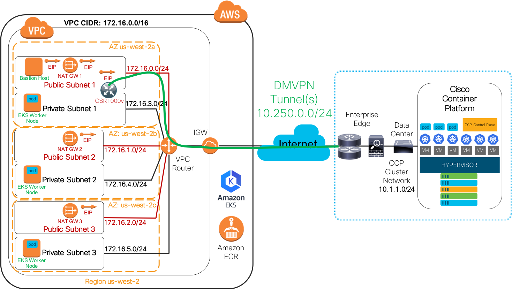


## AWS DMVPN Network Deployment

Using **Figure 2** as the reference topology, we will walk through the Amazon-specific networking details based on the DMVPN network deployment.  As stated in the [Prerequisites](#prerequisites) section, the Cisco Container Platform will create the Amazon VPC, Internet Gateway, at least six subnets, security groups, routes, NAT Gateway, Amazon EKS cluster/worker nodes and, optionally, an Amazon ECR repository.  The Cisco Container Platform will be required to set all of this up before the deployment of the Cisco CSR 1000v in the AWS VPC.

### Network Topology

Let's walk through the topology shown in **Figure 2** and validate that topology using the Amazon Console, kubectl commands and other verification tools (e.g., ping, traceroute).

**Reminder**: The topology, names/tags, CIDRs, number of AZs, number of EKS nodes, etc.. are for reference only. Your actual deployment details will differ from what is shown here.

In **Figure 2**, the example deployment created by the Cisco Container Platform includes the following:
* A single VPC in the Amazon region: us-west-2.
* The single VPC has a CIDR of 172.16.0.0/16.
* There are 3 AZs: us-west-2a, us-west-2b, and us-west-2c.
* There are six subnets inside of the VPC:
  * The three public subnets are using the IPv4 CIDRs of 172.16.0.0/24, 172.16.1.0/24, and 172.16.2.0/24 respectively. These subnets are used for the NAT Gateways and, optionally, one or more Linux Bastion/jump host(s) (not deployed by Cisco Container Platform). There is a public subnet in each of the Amazon AZs. Each subnet has a public route table that has a default route aiming at the IGW that was deployed by the Cisco Container Platform.
  * The three private subnets are using the IPv4 CIDRs of 172.16.3.0/24, 172.16.4.0/24, and 172.16.5.0/24, respectively. Amazon EKS worker nodes use these subnets. Each private subnet is associated with its own private route table that has a default route aiming at the NAT Gateway located in the same AZ as the private subnet. These subnets are placed in Amazon AZs: us-west-2a, us-west-2b, and us-west-2c, respectively.  **Note:** See the Cisco Container Platform documentation on how the placement is handled via the automation.
* There is a single Amazon EKS Cluster, and there are three Amazon EKS worker nodes deployed.
* There is a single Amazon ECR repository.

In addition to the above resources, a single Linux Bastion/jump host is deployed via a basic Amazon CloudFormation template, not by the Cisco Container Platform. This Linux Bastion host is used for SSH access from the Enterprise site and then used to SSH into the EKS worker nodes for network access validation.  It is up to the customer to deploy a Bastion/jump host resource and to also create/update any route tables and security groups according to their security and network policies.

### Network Validation
Before deploying the Cisco CSR 1000v for the Hybrid Cloud DMVPN deployment, let's validate a few things from the summary list of resources shown above. The basic stuff that we want to validate includes:
  1. Ensure that the correct entries are in the public and private route tables.
  2. Ensure that the placement of each EC2 instance (EKS workers and Linux Bastion host) is in the correct Amazon AZ.
  3. Ensure access from the EKS worker nodes to the Internet.
  4. A quick test of the ECR repo from one of the EKS worker nodes using Docker.

### 1. Route Table Validation

#### Public VPC Route Tables

**Figure 3** indicates one of the three Amazon VPC public route tables. Only one is shown as all three are identical. There is a default route (0.0.0.0/0) with a target of the Internet Gateway (igw-xxxx). This route allows for outbound forwarding from any EC2 instance (to include the Cisco CSR 1000v that we will deploy later on) on the public subnets to go out directly to the Internet and Amazon service endpoints via the IGW.

**Figure 3. Amazon VPC Public Route Table**

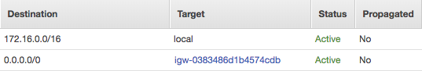

#### Private VPC Route Tables

**Figure 4a-c** indicate the Amazon VPC private route table for each private subnet. There is a default route (0.0.0.0/0) with a target of the NAT Gateway (nat-xxxx) that is associated with the same AZ the subnet is located. Each private route table allows for outbound forwarding from any EC2 instance on each private subnet to go out to the Internet and Amazon service endpoints via the NAT Gateway. After the Cisco CSR 1000v is deployed later on, each of these private route tables will be updated with route entries for each Enterprise-specific internal IPv4 CIDR and a next-hop to the AWS-hosted Cisco CSR 1000v.

**Figure 4a. Amazon VPC Private Route Table us-west-2a**

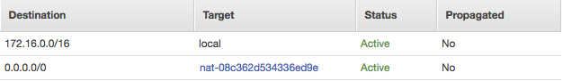

**Figure 4b. Amazon VPC Private Route Table us-west-2b**

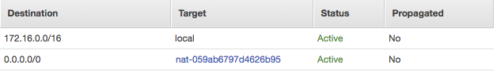

**Figure 4c. Amazon VPC Private Route Table us-west-2c**

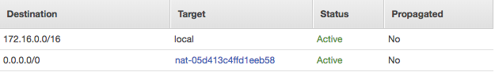

### 2. Amazon EC2 Instance Placement in an AZ

The Cisco Container Platform automation creates subnets and places each one in an AZ. **Table 1** shows a mapping of subnet-to-AZ placement used in this document.

**Table 1. Mapping of Subnets to AZs**

Subnet | Availability Zone
------ | -----------------
172.16.0.0/24 | us-west-2a
172.16.3.0/24 | us-west-2a
172.16.1.0/24 | us-west-2b
172.16.4.0/24 | us-west-2b
172.16.2.0/24 | us-west-2c
172.16.5.0/24 | us-west-2c

**Figure 5** indicates a list of Amazon EC2 instances and their AZ placement. You can see that the Linux Bastion host is in the public subnet (172.16.0.0/24) and it is in the us-west-2a AZ. Each EKS worker node is placed on a different private subnet and each in a different AZ.

**Figure 5. Amazon EC2 and AZ Placement**

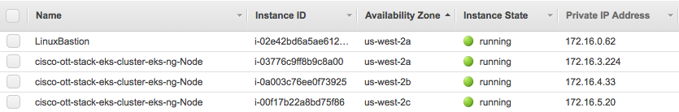

### 3. Access from the EKS Worker Nodes to the Internet

During the Amazon CloudFormation build of the Linux Bastion host, the source IP range of the Enterprise was used to create relevant security group entries for the Linux Bastion host. **Figure 6** indicates a sample security group that allows for SSH and ICMP from the bogus IPv4 CIDR range of the Enterprise site. In this example, the Enterprise IPv4 public CIDR range is an [RFC 1918](https://tools.ietf.org/html/rfc1918) private IP range of 10.0.0.0/8. In a real deployment, this range could be one publically routable IPv4 prefix or many depending on the source IP ranges and the Enterprise security policy.

**Figure 6. Example Linux Bastion Host Security Group**


Before we can access the EKS worker nodes from the Linux Bastion host, we have to modify the default EKS worker node security group to allow for SSH access from the Linux Bastion host security group referenced above.  In **Figure 7**, two new security group entries are made in the EKS worker node security group (Reminder, the Cisco Container Platform created the EKS worker nodes and their security group). The two new security group entries allow for SSH and ICMP from the Linux Bastion host security group. **Note:** This is only an example. You will need to configure every security group according to your own Enterprise network and security policy.

**Figure 7. Example Amazon EKS Worker Node Security Group**

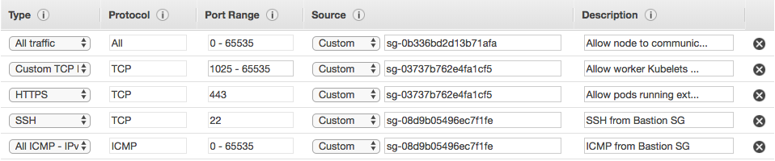

From the Enterprise site, SSH into the Linux Bastion host and from there ping or SSH into the EKS worker nodes. You can gather the IP addresses via the AWS Console or Command Line Interface (CLI) - `aws ec2 describe-instances`.

Using the Private IPv4 Addresses listed in **Figure 5**, ping each EKS worker node from the Linux Bastion host:
```
[ec2-user@ip-172-16-0-62 ~]$ ping 172.16.3.224 -c2
PING 172.16.3.224 (172.16.3.224) 56(84) bytes of data.
64 bytes from 172.16.3.224: icmp_seq=1 ttl=255 time=0.421 ms
64 bytes from 172.16.3.224: icmp_seq=2 ttl=255 time=0.456 ms
```

```
[ec2-user@ip-172-16-0-62 ~]$ ping 172.16.4.33 -c2
PING 172.16.4.33 (172.16.4.33) 56(84) bytes of data.
64 bytes from 172.16.4.33: icmp_seq=1 ttl=255 time=0.902 ms
64 bytes from 172.16.4.33: icmp_seq=2 ttl=255 time=0.872 ms
```

```
[ec2-user@ip-172-16-0-62 ~]$ ping 172.16.5.20 -c2
PING 172.16.5.20 (172.16.5.20) 56(84) bytes of data.
64 bytes from 172.16.5.20: icmp_seq=1 ttl=255 time=1.30 ms
64 bytes from 172.16.5.20: icmp_seq=2 ttl=255 time=1.27 ms
```

Alternatively, you can gather the hostnames of the EKS worker nodes via the AWS Console (EC2 > Instances> Private DNS entry), AWS CLI (`aws ec2 describe-instances`) or using `kubectl`.  The following output is using 'kubectl' from a host located at the Enterprise site. You can set up kubectl for access to your Amazon EKS cluster by following the guidance in the [EKS user guide](https://docs.aws.amazon.com/eks/latest/userguide/configure-kubectl.html).

```
# kubectl get nodes
NAME                                         STATUS    ROLES     AGE       VERSION
ip-172-16-3-224.us-west-2.compute.internal   Ready     <none>    4h        v1.10.3
ip-172-16-4-33.us-west-2.compute.internal    Ready     <none>    4h        v1.10.3
ip-172-16-5-20.us-west-2.compute.internal    Ready     <none>    4h        v1.10.3
```
Ping the DNS name from the Linux Bastion host:

```
[ec2-user@ip-172-16-0-62 ~]$ ping ip-172-16-3-224.us-west-2.compute.internal -c2
PING ip-172-16-3-224.us-west-2.compute.internal (172.16.3.224) 56(84) bytes of data.
64 bytes from ip-172-16-3-224.us-west-2.compute.internal (172.16.3.224): icmp_seq=1 ttl=255 time=0.458 ms
64 bytes from ip-172-16-3-224.us-west-2.compute.internal (172.16.3.224): icmp_seq=2 ttl=255 time=0.495 ms
```
Now, SSH into one of the EKS worker nodes and validate outbound connectivity to the Internet (via the NAT Gateway). 

**Note:** You will need to copy an existing SSH key or create a new one and apply it to the EKS worker nodes in order to securely connect from the Linux Bastion host to the EKS worker nodes. In this example, an existing SSH key was copied to the Linux  Bastion host.

```
[ec2-user@ip-172-16-0-62 ~]$ ssh -i eks.pem ec2-user@ip-172-16-3-224.us-west-2.compute.internal
...OUTPUT_SUMMARIZED...
Are you sure you want to continue connecting (yes/no)? yes

       __|  __|_  )
       _|  (     /   Amazon Linux 2 AMI
      ___|\___|___|

https://aws.amazon.com/amazon-linux-2/
[ec2-user@ip-172-16-3-224 ~]$
```

Ping a DNS name or IPv4 address on the Internet:
```
[ec2-user@ip-172-16-3-224 ~]$ ping www.cisco.com -c2 -n
PING e2867.dsca.akamaiedge.net (69.192.206.157) 56(84) bytes of data.
64 bytes from 69.192.206.157: icmp_seq=1 ttl=44 time=8.34 ms
64 bytes from 69.192.206.157: icmp_seq=2 ttl=44 time=8.10 ms
```

#### _traceroute_ Verification

You can install a Linux utility traceroute and verify that the EKS worker node is exiting the Amazon network via the NAT Gateway. 

**Note:** Ensure you are not violating an Enterprise security policy by installing disallowed packages. :-)

The output below indicates part of a traceroute from one of the EKS worker nodes to www.cisco.com.  We care about the first hop shown. The output shows that the first hop is the IPv4 address of the 'Private IP Address' of the NAT Gateway. **Figure 8** indicates the 'Private IP Address' information of each of the NAT Gateways. The EKS worker node that we are testing from uses the first NAT Gateway listed in **Figure 8**  which has a Private IP Address of 172.16.0.117. This IPv4 address matches what is shown in the first hop of the traceroute. Also, in **Figure 8**, the 'Elastic IP Address' (EIP) is shown. This EIP can be referenced in any ACLs at the Enterprise site by routers/firewalls that need to allow inbound access to any public IPv4 endpoints (e.g., load-balancer VIP) that the EKS worker nodes need to access. **Note:** You should verify these paths for each EKS worker node for each NAT Gateway.
```
[ec2-user@ip-172-16-3-224 ~]$ traceroute www.cisco.com -m3
traceroute to www.cisco.com (69.192.206.157), 3 hops max, 60 byte packets
 1  ip-172-16-0-117.us-west-2.compute.internal (172.16.0.117)  0.345 ms  0.329 ms  0.309 ms
 2  ec2-50-112-0-90.us-west-2.compute.amazonaws.com (50.112.0.90)  13.391 ms ec2-34-221-151-134.us-west-2.compute.amazonaws.com (34.221.151.134)  20.281 ms ec2-50-112-0-66.us-west-2.compute.amazonaws.com (50.112.0.66)  14.244 ms
 3  100.66.8.116 (100.66.8.116)  19.128 ms 100.66.20.24 (100.66.20.24)  16.759 ms 100.66.8.90 (100.66.8.90)  21.485 ms
 ```

**Figure 8. NAT Gateway**

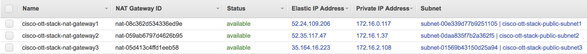

### 4. EKS Worker Node Access to Amazon ECR Repository


The final validation step to ensure that there is both Internet and AWS service connectivity from Amazon EC2 instances will be to validate that we can perform a Docker push to the Amazon ECR repository that the Cisco Container Platform set up. **Note:** This document does not discuss IAM requirements to perform the following test. **<: Provide a link to the CCP ECR documentation>**

In the following example, we are using the Amazon ECR repository set up by the Cisco Container Platform. The example repository, in this case, is called "cisco-ott-stack-ecr-repo". In the AWS Console > Amazon ECS > Amazon ECR > Repositories screen, you will find the repository. In that screen, there is a "View Push Commands". Using these steps is the quickest way to validate access to the ECR repository.

Once you perform the `aws ecr get-login` and `docker login` steps shown in the AWS instructions, [build a test Docker image](https://docs.docker.com/develop/develop-images/baseimages/), tag the image and then push the image to the repository.

#### Docker Build on an EKS Worker Node
```
[ec2-user@ip-172-16-3-224 ~]$ docker build -t cisco-ott-stack-ecr-repo .
Sending build context to Docker daemon  13.31kB
Step 1/11 : FROM ubuntu:12.04
12.04: Pulling from library/ubuntu
d8868e50ac4c: Pull complete
83251ac64627: Pull complete
589bba2f1b36: Pull complete
d62ecaceda39: Pull complete
6d93b41cfc6b: Pull complete
...OUTPUT SUMMARIZED...
Successfully built 943c58b0a1df
Successfully tagged cisco-ott-stack-ecr-repo:latest
```
#### Docker Tag on an EKS Worker Node
```
[ec2-user@ip-172-16-3-224 ~]$ docker tag cisco-ott-stack-ecr-repo:latest <ACCOUNT_ID>.dkr.ecr.<REGION>.amazonaws.com/cisco-ott-stack-ecr-repo:latest
```
#### Docker Push on an EKS Worker Node
```
[ec2-user@ip-172-16-3-224 ~]$ sudo docker push <ACCOUNT_ID>.dkr.ecr.<REGION>.amazonaws.com/cisco-ott-stack-ecr-repo:latest
The push refers to a repository [<ACCOUNT_ID>.dkr.ecr.<REGION>.amazonaws.com/cisco-ott-stack-ecr-repo]
a4210acebf7c: Pushed
67e38d5994d1: Pushed
012083392928: Pushed
27472e3046be: Pushed
f99fa002afcc: Pushed
3efd1f7c01f6: Pushed
73b4683e66e8: Pushed
ee60293db08f: Pushed
9dc188d975fd: Pushed
58bcc73dcf40: Pushed
latest: digest: sha256:736c96fbe637e720d1bd64bb203fa986c735e92a53be685aba209730d43d0277 size: 24
```
Using the 'aws ecr' CLI, check to make sure the image is in the repository:
```
# aws ecr list-images --repository-name cisco-ott-stack-ecr-repo
{
    "imageIds": [
        {
            "imageTag": "latest",
            "imageDigest": "sha256:736c96fbe637e720d1bd64bb203fa986c735e92a53be685aba209730d43d0277"
        }
    ]
}
```

Now that basic connectivity has been validated between subnets, out to the Internet and other AWS services, it is time to deploy the Cisco CSR 1000v EC2 instance. The deployment of the Cisco CSR 1000v can be completed via the AWS Console (e.g., deploy it from Marketplace or deploy it as a new EC2 instance), AWS CLI, AWS API or AWS CloudFormation. 

**Note**: In this document, we are referring only to native AWS toolsets for the deployment of the Cisco CSR 1000v. You are free to use any other toolsets.

## Deploying Cisco CSR 1000v on AWS

The Enterprise-specific Cisco IOS configuration for DMVPN, routing (e.g., OSPF, EIGRP, BGP), security, and monitoring can be completed on the Cisco CSR 1000v via numerous methods that you likely already have in place. This document makes no recommendation on how to deploy the Cisco IOS configuration on the router, but an example AWS CloudFormation template is referenced below, and within that template, a full Cisco CSR 1000v IOS configuration is deployed on the Cisco CSR 1000v EC2 instance at boot time.

### Pre-requisites for Cisco CSR 1000v

Before we can deploy the Cisco CSR 1000v, there is basic information that is required in order to deploy the Cisco CSR 1000v correctly:

* VPC ID used by the EKS cluster
* Public and private subnet CIDRs
* Public and private route table IDs
* SSH key to access Cisco CSR 1000v
* AWS security group entries (e.g., permit SSH from Enterprise, permit IPsec/IKE, etc.)
* Public and Private subnet to attach to the Cisco CSR 1000v.
* IPv4 address assignment of the Cisco CSR 1000v interfaces (If assigining statically)
* The AWS instance type to be used for the Cisco CSR 1000v
* The AWS license model (e.g., BYOL or included)
* Any Enterprise-specific Cisco IOS configuration information such as OSPF area, DMVPN tunnel/IPsec/IKE info from hub site etc.


In the example walk-through in this document, we will obtain the VPC ID directly from the Cisco Container Platform UI for the AWS EKS clusters. **<: Provide a link to the CCP VPC documentation>**. You can also obtain the VPC ID from the AWS EKS console if you know the EKS cluster name that was deployed. 

The VPC ID is provided as an input to a custom shell script <**<: UPDATE with new script URL>**. The script output shows that the VPC ID is used to fetch the required AWS subnet and route table information is gathered via the AWS CLI and dumped into a text file called "myvpcinfo.txt". This information will be required in the later steps when deploying the Cisco CSR 1000v

**Note**: This script requires that you have the AWS CLI installed and configured for authentication into AWS. Information for installing and setting up the AWS CLI can be found here: [AWS CLI](https://aws.amazon.com/cli/).

```
# ./aws-vpc-input-6-subnets-output-.sh <YOUR_VPC_ID> | tee myvpcinfo.txt
# cat myvpcinfo.txt
 The VPC ID BEING USED IS
vpc-xxxxxxxx
 GET ROUTE TABLE IDs
 Public route table 1 ID is:
rtb-088a0ebbd69b5115f
 Public route table 2 ID is:
rtb-099d903aec027292d
 Public route table 3 ID is:
rtb-099d903aec027292d
 Private route table 1 ID is:
rtb-0c351ea7dc128ce2d
 Private route table 2 ID is:
rtb-0960253a1b1b6c281
 Private route table 3 ID is:
rtb-0d1f238019ae4595c
 GET ALL SUBNET CIDR RANGES
 Public subnet 1 CIDR range is:
172.16.0.0/24
 Public subnet 2 CIDR range is:
172.16.1.0/24
 Public subnet 3 CIDR range is:
172.16.2.0/24
 Private subnet 1 CIDR range is:
172.16.3.0/24
 Private subnet 2 CIDR range is:
172.16.4.0/24
 Private subnet 3 CIDR range is:
172.16.5.0/24
```

With the information from the script output and the other required information that was gathered from the bulleted list above, we are ready to use the sample AWS CloudFormation template for the Cisco CSR 1000v deployment located here:  **<: Provide a link github csr CF template>**.  In this document, we will deploy the sample template via the AWS CloudFormation in the [AWS Console](https://us-west-2.console.aws.amazon.com/cloudformation/home?region=us-west-2#/stacks). 

To use the above template:
* Download the template.
* From the AWS CloudFormation Console, click "Create Stack" --> "Choose a template" --> "Choose File" and then select the sample template that you downloaded and then, click "Next".


**Note: The sample Cisco CSR 1000v AWS CloudFormation template that is provided is to be used ONLY as a reference. **_You must not use it as-is._** There are default values, fill-in-the-blank references and sample topology-specific information in the template that are incompatible with your environment. Once you have downloaded the template and modified the resources and parameters that are required for your environment, then follow along with the rest of the steps shown below.**

Following are the fields in the CloudFormation Template that will be required to update based on the Enterprise Site to allow AWS Hosted CSR to connect to Enterprise hosted CSR/ASR:
* In the `MulticloudCSRInstance` section update the `UserData` for the option _ios-config-40=\"ip nhrp nhs 10.250.0.1 nbma <public_ip_of_enterprise_ASR> multicast\"_ 


In the Create Stack screen, all of the fields are required, and will be set to defaults from the template uploaded. It is recommended to review these fields and set according to the Enterprise requirements. Information regarding the VPCs, Route Tables, Private Subnets related fields can be obtained from the script discussed above.

**Figure 9. AWS CloudFormation Stack Create Example**

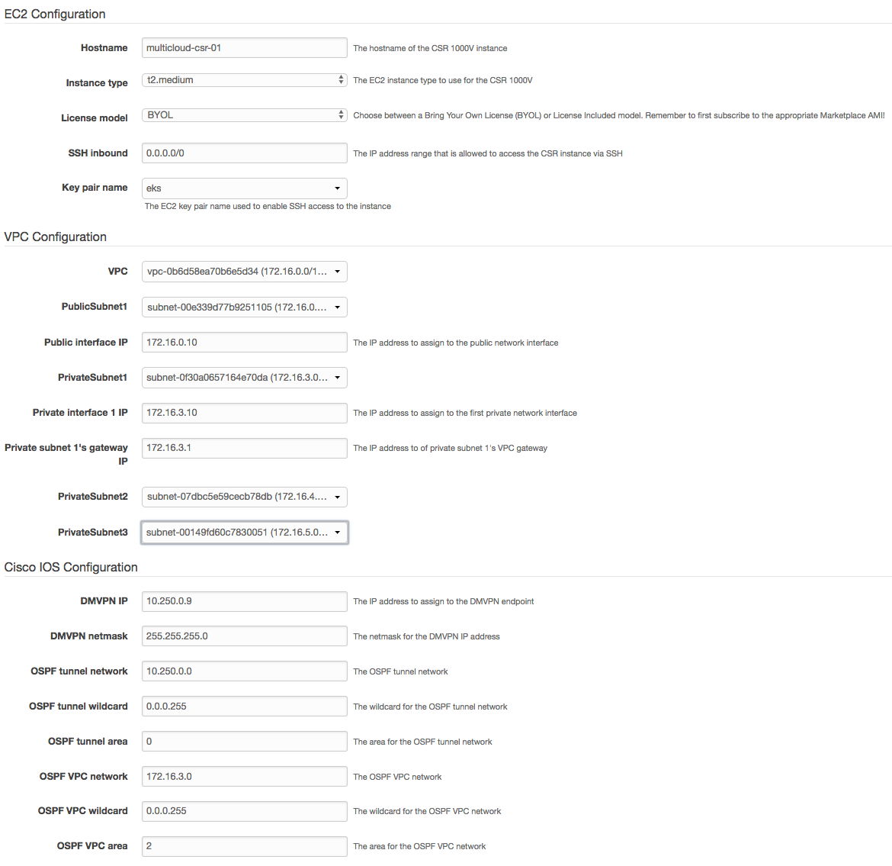

**Figure 9**, shows an example screenshot of the Stack Parameters screen. You can see that we are:
* Naming the router `multicloud-csr-01`
* Using an AWS EC2 instance type of 't2.medium'
* Using the BYOL licensing model
* Allowing SSH access from anywhere (you will want to lock this down), and selecting an existing SSH key.  
* In the VPC Configuration section:
    * The VPC that matches what we got from the Cisco Container Platform.
    * The Public Subnet that we want the outside interface (GigabitEthernet1) of the Cisco CSR 1000v to attach to.
    * The IPv4 address of Public Subnet interface (GigabitEthernet1) of CSR 1000v to be i.e. the  (172.16.0.10). 
    * The Private Subnet we want for the inside interface (GigabitEthernet2) of the Cisco CSR 1000v to attach to and its IPv4 address. 
    * The Private Subnet's Gateway IP (this is always ".1" of whatever subnet CIDR you select). This IPv4 address is important as the AWS CloudFormation sample template will create static route entries on the Cisco CSR 1000v with the IPv4 CIDR of the private subnets that it is not directly attached to with a next-hop of the AWS VPC router IPv4 address on the private subnet that it is attached to. We will walk through the routing flow of this later in the document so that you have a firm understanding of how this works. 
* Cisco IOS Configuration
    * The sample template provides some input fields specific to DMVPN and OSPF. In **Figure 9**, the AWS side of the DMVPN tunnel will have an IPv4 address of 10.250.0.9 on Tunnel0 (shown later). 
    * The OSPF network/wildcard for the Tunnel network is shown along with the area and which private IPv4 CIDR the inside interface of the Cisco CSR 1000v is attached to and its area ID.


Follow the rest of the screens and select parameters that matter to you and then click "Create". After a few minutes, the stack will end with a Status: `CREATE_COMPLETE`.

Let's walk through what the template deployed.

The sample Amazon CloudFormation stack deployed the following resources:
* A single EC2 instance using the template-defined instance type (t2.medium) and AMI.
* A new security group with following properties:
    *  Allows inbound SSH, ICMP (optional), 
    *  Protocol 50 (For Encapsulated Security Payload [ESP]) 
    *  Port 500/UDP (Internet Security Association and Key Management Protocol [ISAKMP])
    *  Port 4500/UDP (For ISAKMP over NAT [AKA: NAT-T]).
* Two EC2 network interfaces with static IPv4 address definitions:
    *  eth0/GigabitEthernet1 = 172.16.0.10
    *  eth1/GigabitEthernet2 = 172.16.3.10
    *  source/destination checking disabled on the eth1/GigabitEthernet2 network attachment (this allows for successful forwarding to/from the private subnet that the Cisco CSR 1000v is attached to).
* A single route table entry on each private route table that forwards packets with a destination to the Cisco Container Platform network (e.g., 10.1.1.0/24) to a next-hop of the Cisco CSR 1000v EC2 instance 'inside' or private interface (The actual ENI of the EC2 eth1 network interface).
* A full DMVPN and OSPF configuration that matches up to the expected configuration of the Enterprise DMVPN Hub router(s)

**Figure 10** shows the EC2 Description of the Cisco CSR 1000v instance that Amazon CloudFormation built.

**Figure 10. Cisco CSR 1000v EC2 Instance Description**

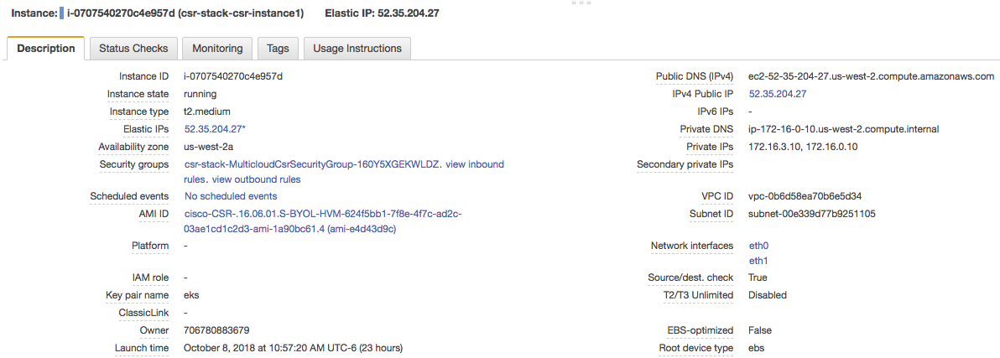

**Figure 11a** shows the new Cisco CSR 1000v specific security group. The figure shows that SSH and ICMP are allowed from the bogus Enterprise networks of 10.0.0.0/8 and 192.168.0.0/24. ESP, ports 500/UDP and 4500/UDP are allowed from the two Enterprise Hub routers (192.160.0.10/32, 192.160.0.11/32), and ICMP is allowed for testing purposes from each of the Amazon VPC private subnets. **Note: This is a sanitized version that is safe for documentation.** 

**Figure 11a. Cisco CSR 1000v Security Group**

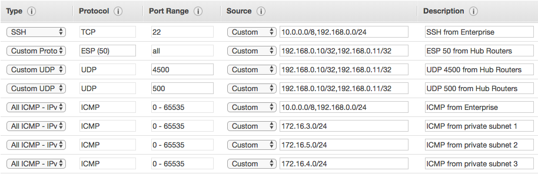

    Note: if it is simply desired for all TCP traffic, originating from the VPC's
    private subnets, to reach the Enterprise networks then the following
    Security Group Rules could be specified as per Figure 11b:

**Figure 11b. Additional CSR 1000v Security Group rules permitting all VPC (TCP) traffic**

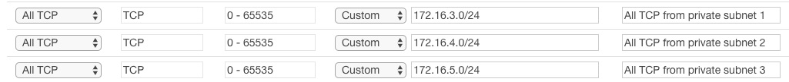

**Figures 12a-b** shows the two EC2 network interfaces that are used by the Cisco CSR 1000v EC2 instance and that are attached to an Amazon VPC public and private subnet. Note that in **Figure 12b** the "Source/Dest. Check" is set to "false". When you deploy your own Cisco CSR 1000v, you must ensure that any network interface that attaches to a private subnet must have the Source/Dest checking set to 'false' or routing in to/out of the Cisco CSR 1000v on that subnet will fail.

**Figure 12a. Cisco CSR 1000v Network Interface eth0**

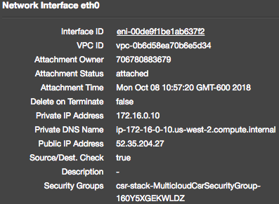

**Figure 12b. Cisco CSR 1000v Network Interface eth1**

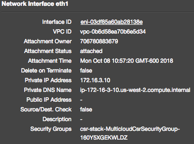

**Figures 13a-b** shows each private route table. Notice that there is a single route table entry for 10.1.1.0/24 with a next-hop (Target) of the Cisco CSR 1000v ENI. You can see that the ENI referenced matches the ENI assigned to the EC2 network interface shown in **Figure 12b**.

**Figure 13a. Private Route Table 1 with Cisco CSR Route Entry**

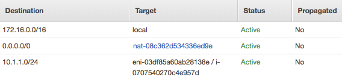

**Figure 13b. Private Route Table 2 with Cisco CSR Route Entry**

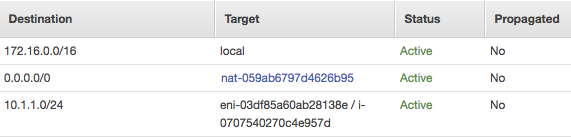

**Figure 13c. Private Route Table 3 with Cisco CSR Route Entry**

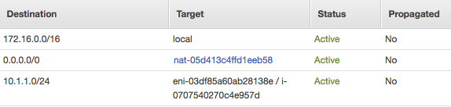

The following output is from the Amazon-hosted Cisco CSR 1000v, and it shows the following configuration:
* Interface configurations for GigabitEthernet 1 and 2
* IPsec/IKE and DMVPN configurations which were provided by the Enterprise network operations team
* OSPF configurations which were provided by the Enterprise network operations team

**Note:** The following output has been sanitized so that it is safe for public documentation.

**Cisco CSR 1000v Interface Configuration**

```
interface GigabitEthernet1
 ip address dhcp
 negotiation auto
 no mop enabled
 no mop sysid
!
interface GigabitEthernet2
 description Inside
 ip address dhcp
 negotiation auto
 no mop enabled
 no mop sysid
!
```
The Cisco CSR 1000v is deployed with both GigabitEthernet interfaces in DHCP mode, and the EC2 instance receives its addresses via the Amazon metadata service. You can see that the two IPv4 addresses that are shown below match what was set in the Amazon CloudFormation template in **Figure 9** and what matches the EC2 instance network interfaces in **Figures 12a and 12b**.
```
multicloud-csr-01# show ip interface brief
Interface              IP-Address      OK? Method Status                Protocol
GigabitEthernet1       172.16.0.10     YES DHCP   up                    up
GigabitEthernet2       172.16.3.10     YES DHCP   up                    up
```
**Cisco CSR 1000v IPsec/IKE and DMVPN Configuration**

The following output shows a sanitized IPsec/IKEv2, and DMVPN configuration for the Cisco CSR 1000v DMVPN Spoke router. Your network/security operations teams will have specific configurations for IKE and IPsec to include nailing down the keyring address range, match identity IP and the proposal elements. You can see that Tunnel0 is using the same IPv4 address shown in the Amazon CloudFormation template in **Figure 9**. Again, the Amazon CloudFormation template that is used to deploy this Cisco IOS configuration is using mostly pre-defined parameters which may not be ideal for your use case.

```
crypto ikev2 proposal AES/GCM/256
 encryption aes-gcm-256
 prf sha512
 group 19
!
crypto ikev2 policy AES/GCM/256
 match fvrf any
 proposal AES/GCM/256
!
crypto ikev2 keyring DMVPN-KEYRING
 peer ANY
  address 0.0.0.0 0.0.0.0
  pre-shared-key <PRE_SHARED_KEY_HERE>
 !
!
crypto ikev2 profile DMVPN-IKEv2-PROFILE
 description PSK Profile
 match identity remote address 0.0.0.0
 authentication remote pre-share
 authentication local pre-share
 keyring local DMVPN-KEYRING
 dpd 40 5 on-demand
!
crypto ipsec security-association replay window-size 1024
!
crypto ipsec transform-set AES256/GCM/TRANSFORM esp-gcm 256
 mode transport
!
crypto ipsec profile DMVPN-IPSEC-PROFILE
 set transform-set AES256/GCM/TRANSFORM
 set ikev2-profile DMVPN-IKEv2-PROFILE
!
interface Tunnel0
 description DMVPN
 ip address 10.250.0.9 255.255.255.0
 no ip redirects
 ip mtu 1400
 ip nhrp authentication <NHRP_AUTHENTICATION_KEY_HERE>
 ip nhrp network-id 100
 ip nhrp nhs 10.250.0.1 nbma <PUBLIC_IP_ADDRESS_OF_HUB_1_HERE> multicast
 ip tcp adjust-mss 1360
 ip ospf authentication-key 7 <OSPF_AUTH_KEY_HERE>
 ip ospf network point-to-multipoint
 ip ospf hello-interval 10
 tunnel source GigabitEthernet1
 tunnel mode gre multipoint
 tunnel key 100
 tunnel protection ipsec profile DMVPN-IPSEC-PROFILE
 ```
**Cisco CSR 1000v OSPF Configuration**

The Amazon CloudFormation template uses OSPF, and it uses the Tunnel0 IP address as the router-id (use whatever OSPF RID source that meets your policy). In this example, the Tunnel0 network is associated with OSPF Area 0, and the directly attached private subnet (172.16.3.0/24) is associated with OSPF Area 2. Finally, the AWS metadata logic sets the default route to the public subnet VPC router IPv4 address and there are two static routes (CIDRs are input into the stack parameters in **Figure 9**) for the other two VPC private subnets with the next-hop set to the directly attached private subnet VPC router IPv4 address. The static routes for the two other private subnets are redistributed to the Enterprise DMVPN Hub routers via the 'redistribute static subnets' command. You will likely create route filters in whatever IGP/EGP you use.

```
router ospf 10
 router-id 10.250.0.9
 redistribute static subnets
 network 10.250.0.0 0.0.0.255 area 0
 network 172.16.3.0 0.0.0.255 area 2
!
ip route 0.0.0.0 0.0.0.0 GigabitEthernet1 172.16.0.1
ip route 172.16.4.0 255.255.255.0 172.16.3.1
ip route 172.16.5.0 255.255.255.0 172.16.3.1
```
The next section will cover what the Enterise-side of this configuration looks like and we will show the routing and connectivity validation for the use case.

## Enterprise DMVPN Network Deployment

There are a countless number of Enterprise network designs for the Data Center, Private Clouds, Enterprise/Internet Edge, Core, Campus, and WAN/Branch. As stated before, from a fundamental network connectivity standpoint, as long as the Cisco Container Platform can reach the public Amazon service endpoints for non-Kubernetes workload traffic, it does not matter which design you use. With that said, care must be taken to understand the application/microservice requirements and map those to an Enterprise network design that provides the best performance, high-availability, security, management, and automation. As mentioned in the [Prerequisites](#prerequisites) section, it is appropriate to use an existing VPN-based or dedicated connection (e.g., AWS DirectConnect) or establish a new one to allow Cisco Container Platform and AWS EKS workloads to communicate with each other over a private, secure network connection. In this section, a basic DMVPN design is used, and the Enterprise site will act as the DMVPN Hub for the AWS Cisco CSR 1000v router.

In the DMVPN network deployment discussed in this document, the Cisco Container Platform is deployed on a VMware vSphere cluster located in an Enterprise Data Center. As **Figure 14** indicates, The Cisco Container Platform connects to a series of Data Center switches which then connect to an Enterprise/Internet Edge. The Enterprise/Internet Edge is comprised of several tiers of routers, firewalls, load-balancers and other, more focused, security devices.  For the sake of the DMVPN network deployment discussed in this document, we care about basic network connectivity for the following:

* Access to the public Amazon service endpoints from the Cisco Container Platform control plane: The purpose of this access is to allow encrypted (SSL/TLS) programmatic access to various Amazon services as well as encrypted (SSL/TLS) access to the AWS ECR repo. Connectivity for this use case is provided by Internet services.
* Access to the Amazon EKS worker nodes from the Cisco Container Platform worker nodes: The purpose of this access is to allow private, encrypted access between Kubernetes pods running on Amazon EKS and Kubernetes pods running on the Cisco Container Platform. Connectivity for this use is provided by the DMVPN deployment.

**Figure 14. Review - Detailed Topology View for the Amazon VPC, EKS, ECR, and Cisco Container Platform Deployment**


Following along from the right side of **Figure 14**, the VMs that the Cisco Container Platform run on are connected to [VMware vSphere Distributed Switches (VDS)](https://www.vmware.com/products/vsphere/distributed-switch.html). The VMware vSphere VDS is connected to the Data Center Top-of-Rack switches via [Cisco UCS Virtual Interface Cards](https://www.cisco.com/c/en/us/products/interfaces-modules/unified-computing-system-adapters/index.html). The Data Center switches connect into the Enterprise/Internet Edge tier, which, again, is comprised of various routers, firewalls, other security devices, and load-balancers.  Eventually, the Enterprise/Internet Edge is connected to one or more Internet Service Providers (ISPs) or, in an [Amazon DirectConnect](https://aws.amazon.com/directconnect/) or Cloud/Network Exchange model, directly to a colocation (colo) site or directly to the Cloud Provider.  At this point, an Enterprise routing decision is made. If the destination is to an IPv4 address that is not designated as an IPv4 address for the Amazon EKS worker nodes, then the packet follows the path to the Internet. If the destination is to an IPv4 address that is designated as an IPv4 address for the Amazon EKS worker nodes, then the packet is forwarded to the DMVPN Hub router(s) and then forwarded through the DMVPN tunnel onto the Amazon-hosted Cisco CSR 1000v router.

The following output shows a sanitized version of one of the Enterprise DMVPN Hub router's interfaces, IPsec/IKE, DMVPN, and OSPF configuration.

**Cisco ASR 1000 DMVPN Hub Interface Configuration**

In this example, the Cisco ASR 1000 has two Ten Gigabit Ethernet interfaces (TenGigabitEthernet0/0/0, TenGigabitEthernet0/0/1) connected to an Enterprise Edge switch in a Port-Channel configuration. The Port Channel (Port-channel1) has two sub-interfaces (Port-channel1.101, Port-channel1.105). Port-channel1.101 is used to connect back to an Enterprise Edge inner security tier which then connects back to the Enterprise Data Center where the Cisco Container Platform is located. Port-channel1.105 is used to connect back to an Enterprise Edge outer security tier which then connects to the Internet. The IPv4 address assigned to Port-channel1.105 is used by the Amazon-hosted Cisco CSR 1000v for DMVPN. **Note:** Optionally, another device such as an Enterprise Edge outer firewall (e.g., Cisco ASA 5500 series) can perform static NAT (1:1 mapping) for the IPv4 address used for this DMVPN Hub router. Ensure that all security groups and firewalls have enabled support for UDP/4500 (ISAKMP over NAT-T).

```
interface Port-channel1
 description Edge Switch
 no ip address
!
interface Port-channel1.101
 description VLAN101 Private Network
 encapsulation dot1Q 101
 ip address 10.1.0.2 255.255.255.0
 standby version 2
 standby 0 ip 10.1.0.1
 standby 0 priority 110
 standby 0 preempt
 standby 0 authentication md5 key-string 7 <HSRP_KEY_STRING_HERE>
 standby 0 track 10 decrement 10
 ip ospf authentication-key 7 <OSPF_AUTH_KEY_HERE>
!
interface Port-channel1.105
 description VLAN105 Public Network
 encapsulation dot1Q 105
 ip address 192.168.0.10 255.255.255.0
 no ip redirects
 no ip unreachables
 no ip proxy-arp
!
interface TenGigabitEthernet0/0/0
 no ip address
 channel-group 1 mode active
!
interface TenGigabitEthernet0/0/1
 no ip address
 channel-group 1 mode active
```

**Cisco ASR 1000 DMVPN Hub IPsec/IKE and DMVPN Tunnel Configuration**

The following output shows a sanitized IPsec/IKEv2 and DMVPN tunnel configuration for the Cisco ASR 1000 DMVPN Hub router. Your own network/security operations teams will have specific configurations for IKE and IPsec to include nailing down the keyring address range, match identity IP and the proposal elements. You can see that Tunnel0 is using an IPv4 address in the same CIDR range as the Cisco CSR 1000v Tunnel0 interface.

```
crypto ikev2 proposal AES/GCM/256
 encryption aes-gcm-256
 prf sha512
 group 19
!
crypto ikev2 policy AES/GCM/256
 match fvrf any
 proposal AES/GCM/256
!
crypto ikev2 keyring DMVPN-KEYRING
 peer ANY
  address 0.0.0.0 0.0.0.0
  pre-shared-key <PRE_SHARED_KEY_HERE>
 !
!
crypto ikev2 profile DMVPN-IKEv2-PROFILE
 description PSK Profile
 match identity remote address 0.0.0.0
 authentication remote pre-share
 authentication local pre-share
 keyring local DMVPN-KEYRING
 dpd 40 5 on-demand
!
crypto isakmp keepalive 10 10
!
crypto ipsec security-association replay window-size 128
!
crypto ipsec transform-set AES256/GCM/TRANSFORM esp-gcm 256
 mode transport
crypto ipsec df-bit clear
!
crypto ipsec profile DMVPN-IPSEC-PROFILE
 set transform-set AES256/GCM/TRANSFORM
 set ikev2-profile DMVPN-IKEv2-PROFILE
!
interface Tunnel0
 description DMVPN
 ip address 10.250.0.1 255.255.255.0
 no ip redirects
 ip mtu 1400
 ip nhrp authentication <NHRP_AUTHENTICATION_KEY_HERE>
 ip nhrp network-id 100
 ip nhrp redirect
 ip tcp adjust-mss 1360
 ip ospf authentication-key 7 <OSPF_AUTHENTICATION_KEY_HERE>
 ip ospf network point-to-multipoint
 ip ospf hello-interval 10
 tunnel source Port-channel1.105
 tunnel mode gre multipoint
 tunnel key 100
 tunnel protection ipsec profile DMVPN-IPSEC-PROFILE
```

**Cisco ASR 1000 DMVPN Hub OSPF Configuration**

In this example, the Tunnel0 network is associated with OSPF Area 0 and the directly attached Enterprise Edge inner subnet (10.1.0.0/24) is also associated with OSPF Area 0. There is a single default route set with the next-hop of the Enterprise Edge outer gateway IPv4 address.  No route filters are shown here, but in a production deployment, filtering routes in/out of this tier of Hub routers would be necessary to prevent unwanted route re-distribution between sites.

```
router ospf 10
 router-id 10.250.0.1
 network 10.1.0.0 0.0.0.255 area 0
 network 10.250.0.0 0.0.0.255 area 0
!
ip route 0.0.0.0 0.0.0.0 192.168.0.1
```

We will use **Figure 15** as a reference for the routing output for both the Amazon-hosted Cisco CSR 1000v router and the Enterprise-hosted Cisco ASR 1000 router.

**Figure 15. Review - Topology View of the Cisco CSR 1000v and Cisco ASR 1000 DMVPN and Routing Configuration**

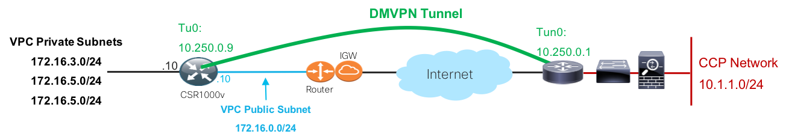

The following routing output from the Cisco ASR 1000 shows that all three AWS VPC private subnets (172.16.3.0/24, 172.16.4.0/24, and 172.16.5.0/24) learned via OSPF and the next-hop to those destinations is the Tunnel0 IPv4 address (10.250.0.9) of the Cisco CSR 1000v router. Notice that the 172.16.3.0/24 route is learned as an OSPF inter area route (it is directly connected to the Cisco CSR 1000v) and that the 172.16.4.0/24 and 172.16.5.0/24 routes are OSPF external type 2 routes (they are redistributed static routes).

```
HUB_ASR1K_1#show ip route 172.16.0.0
Routing entry for 172.16.0.0/24, 3 known subnets
O IA     172.16.3.0 [110/1001] via 10.250.0.9, 1d02h, Tunnel0
O E2     172.16.4.0 [110/20] via 10.250.0.9, 1d02h, Tunnel0
O E2     172.16.5.0 [110/20] via 10.250.0.9, 1d02h, Tunnel0
```

The following routing output from the Cisco CSR 1000v shows that the Enterprise subnet used to host the Cisco Container Platform cluster (10.1.1.0/24) is learned via OSPF and the next-hop to that destination is the Tunnel0 IPv4 address (10.250.0.1) of the Cisco ASR 1000 DMVPN Hub router.

```
multicloud-csr-01#show ip route | include 10.1.1.0
O        10.1.1.0/24 [110/1001] via 10.250.0.1, 1d02h, Tunnel0
```

Let's validate that an Amazon EKS worker node can access an Enterprise-hosted Cisco Container Platform worker node. From one of the EKS worker nodes (172.16.3.224 - See the list in **Figure 5**), you can see that pings to one of the Cisco Container Platform worker nodes (10.1.1.106) are successful:
```
[ec2-user@ip-172-16-3-224 ~]$ ping 10.1.1.106 -c2
PING 10.1.1.106 (10.1.1.106) 56(84) bytes of data.
64 bytes from 10.1.1.106: icmp_seq=1 ttl=62 time=23.1 ms
64 bytes from 10.1.1.106: icmp_seq=2 ttl=62 time=23.2 ms
```

Traceroutes between the same pair of nodes shows that the EKS worker node (172.16.3.224) is directed via the VPC private route table associated with subnet 172.16.3.0/24 to the next-hop of 172.16.3.10 (the Cisco CSR 1000v eth1/GigabitEthernet2 IPv4 address). Then, the packet is routed through the DMVPN tunnel to the Cisco ASR 1000 Tunnel0 (10.250.0.1) interface, on to the Enterprise Edge inner routing tier and then on the Cisco Container Platform worker node (10.1.1.106)

```
[ec2-user@ip-172-16-3-224 ~]$ sudo traceroute 10.1.1.106 --icmp -n
traceroute to 10.1.1.106 (10.1.1.106), 30 hops max, 60 byte packets
 1  172.16.3.10  1.004 ms  0.994 ms  0.992 ms
 2  10.250.0.1  23.399 ms  23.492 ms  23.412 ms
 3  10.1.0.5    23.401 ms  23.488 ms  23.417 ms
 ...OUTPUT SUMMARIZED
 6  10.1.1.106  23.414 ms  23.440 ms  23.485 ms
 ```

 The following output shows that any traffic not matching the 10.1.1.0/24 route table entry will follow the default route path through the Amazon NAT GW (see **Figure 8**).
 ```
 [ec2-user@ip-172-16-3-224 ~]$ traceroute www.cisco.com -m3
traceroute to www.cisco.com (69.192.206.157), 3 hops max, 60 byte packets
 1  ip-172-16-0-117.us-west-2.compute.internal (172.16.0.117)  0.226 ms  0.238 ms  1.738 ms
 2  ec2-34-221-151-130.us-west-2.compute.amazonaws.com (34.221.151.130)  13.864 ms ec2-34-221-151-128.us-west-2.compute.amazonaws.com (34.221.151.128)  13.144 ms ec2-50-112-0-94.us-west-2.compute.amazonaws.com (50.112.0.94)  73.587 ms
 3  100.66.8.0 (100.66.8.0)  21.918 ms 100.66.8.14 (100.66.8.14)  15.030 ms 100.66.20.88 (100.66.20.88)  15.648 ms
 ```
### Cisco Cloud Platform Access to Amazon ECR Repository

The next thing to validate is access from the Cisco Cloud Platform to the Amazon ECR repo. We will validate this by performing a 'docker pull' of the image that was pushed into the AWS ECR repository earlier in the document ([AWS DMVPN Network Deployment](#aws-dmvpn-network-deployment)):

On one of the Cisco Cloud Platform worker nodes, complete the AWS documented steps for the 'docker login' process and then perform a docker pull of the ECR image:
```
ccpuser@ccp-alk-01-worker23c5f35919:~$ sudo docker login -u AWS -p <OUTPUT_OMITTED> https://<ACCOUNT_ID>.dkr.ecr.<REGION>.amazonaws.com
Login Succeeded
```
```
ccpuser@ccp-alk-01-worker23c5f35919:~$ sudo docker pull <ACCOUNT_ID.dkr.ecr.<REGION>.amazonaws.com/cisco-ott-stack-ecr-repo:latest
latest: Pulling from cisco-ott-stack-ecr-repo
396e9d6ee8c9: Pull complete
403b0fc2e6f1: Pull complete
7124ef1a91d2: Pull complete
f47441d15565: Pull complete
588e8920e707: Pull complete
8ff27c835101: Pull complete
c76c2f6e7d88: Pull complete
6f223e887cd0: Pull complete
4cf3e3f00cc4: Pull complete
d0c592ce7f57: Pull complete
Digest: sha256:736c96fbe637e720d1bd64bb203fa986c735e92a53be685aba209730d43d0277
Status: Downloaded newer image for <ACCOUNT_ID>.dkr.ecr.<REGION>.amazonaws.com/cisco-ott-stack-ecr-repo:latest
```
The Cisco Container Platform worker node successfully logged into the Amazon ECR private repository and pulled the image that the Amazon EKS worker node pushed to the repository. The path for the connection to the ECR repo is over the public Internet connection.

Now, lets test that a pod running in the Cisco Container Platform can access the EKS worker node over the DMVPN connection. **Note:** You will have to adjust the Amazon EKS node security group to allow for ICMP traffic from the sourcing network (e.g., 10.1.1.0/24)

```
ccpuser@ccp-alk-01-master34f029d230:~$ kubectl run -i -t busybox --image=busybox --restart=Never
If you don't see a command prompt, try pressing enter.
/ # ping 172.16.3.224 -c2
PING 172.16.3.224 (172.16.3.224): 56 data bytes
64 bytes from 172.16.3.224: seq=0 ttl=252 time=24.575 ms
64 bytes from 172.16.3.224: seq=1 ttl=252 time=23.463 ms
```
A simple tcpdump on the Amazon EKS worker node shows the source IPv4 address being used by the Cisco Container Platform pod at the Enterprise. The pod is running on the Cisco Container Platform worker node with the IPv4 address of 10.1.1.107:

```
[ec2-user@ip-172-16-3-224 ~]$ sudo tcpdump -i eth0 icmp -n
tcpdump: verbose output suppressed, use -v or -vv for full protocol decode
listening on eth0, link-type EN10MB (Ethernet), capture size 262144 bytes
20:32:55.099065 IP 10.1.1.107 > 172.16.3.224: ICMP echo request, id 2816, seq 0, length 64
20:32:55.099114 IP 172.16.3.224 > 10.1.1.107: ICMP echo reply, id 2816, seq 0, length 64
```

## Summary

The DMVPN network deployment is a great choice for connecting Enterprise on-premises Cisco Container Platform workloads to Amazon EKS workloads and also Amazon ECR private repositories. The deployment discussed in this document showed that access to Amazon public service endpoints can be supported over the public Internet while the actual Amazon EKS workloads and the Enterprise on-premises Cisco Container Platform workloads can communicate securely over a DMVPN deployment using Cisco IOS-XE routing platforms.

There may be some cases where a full DMVPN or even, simple IPsec VPN deployment is not required. In those cases, a simple Internet Over-the-Top (OTT) deployment may suffice.  Please reference the [Hybrid Cloud - Internet Over-the-Top Network Deployment](https://wwwin-github.cisco.com/CPSG/multicloud/blob/master/aws/public/docs/network/ott/README.md)**<: Insert final link to the OTT document>**

## Reference Information

The following reference information can be used to understand the Amazon region and service endpoints as well as obtain the various Amazon NAT Gateway IPv4 address so that the Enterprise routing and security filters can be applied.

### Validating IPv4 Addresses for Routing/Access Control

As mentioned in the [AWS DMVPN Network Deployment](#aws-dmvpn-network-deployment) section, the AWS VPC NAT Gateway Elastic IP can be used on the router/firewalls at the Enterprise/Internet Edge site to control what is allowed to/from the AWS site for a given application or service.  Similarly, the Enterprise public IP address that is used in an Enterprise Source NAT (SNAT) pool can be used to apply security group entries at AWS to control ingress access to AWS resources.

The information that needs to be provided to the relevant network/data center/security/cloud-ops teams so they can properly route and secure bi-directional traffic in the hybrid cloud includes:
* Amazon region and service endpoint information (graphical example in **Figure 11**):
  * [Amazon IP address list](https://docs.aws.amazon.com/general/latest/gr/aws-ip-ranges.html#aws-ip-download)
  * [Amazon Regions and Endpoints list](https://docs.aws.amazon.com/general/latest/gr/rande.html)
    * [Region/Endpoint list for Amazon EKS](https://docs.aws.amazon.com/general/latest/gr/rande.html#eks_region)
    * [Region/Endpoint list for Amazon ECR](https://docs.aws.amazon.com/general/latest/gr/rande.html#ecr_region)

**Figure 16. Amazon EKS and ECR Regional Endpoints**


* Amazon VPC NAT Gateway Elastic IP (shown here again from **Figure 8**):

**Figure 17 NAT Gateway - A Second Look**


* Enterprise/Internet Edge SNAT IPv4 address (port overload configuration) or SNAT pool range (pool configuration). The Enterprise InfoSec or network operations team will know what these IP addresses are. If you need to find out for yourself, you can install tcpdump on the Linux Bastion host (e.g., 'sudo install tcpdump -y') and then, from the Cisco Container Platform, deploy a pod and ping the Linux Bastion host at Amazon (ensure the security group allows for SSH from your address space):
  * Deploy a test pod on the Cisco Container Platform and ping the EIP of the Linux Bastion host:
```
ccpuser@ccp-alk-01-master34f029d230:~$ kubectl run -i -t busybox --image=busybox --restart=Never
If you don't see a command prompt, try pressing enter.
/ #
```
```
/ # ping <EIP_OF_BASTION_HOST>
```
  * Install and run tcpdump on the Linux Bastion host - The tcpdump will show the Enterprise public IP address being used for SNAT (shown below as 10.1.10.1):
```
[ec2-user@ip-172-16-0-62 ~]$ sudo tcpdump -i eth0 icmp -n
tcpdump: verbose output suppressed, use -v or -vv for full protocol decode
listening on eth0, link-type EN10MB (Ethernet), capture size 65535 bytes
20:44:20.664002 IP 10.1.10.1 > 172.16.0.62: ICMP echo request, id 3328, seq 0, length 64
20:44:20.664027 IP 172.16.0.62 > 10.1.10.1: ICMP echo reply, id 3328, seq 0, length 64
```
