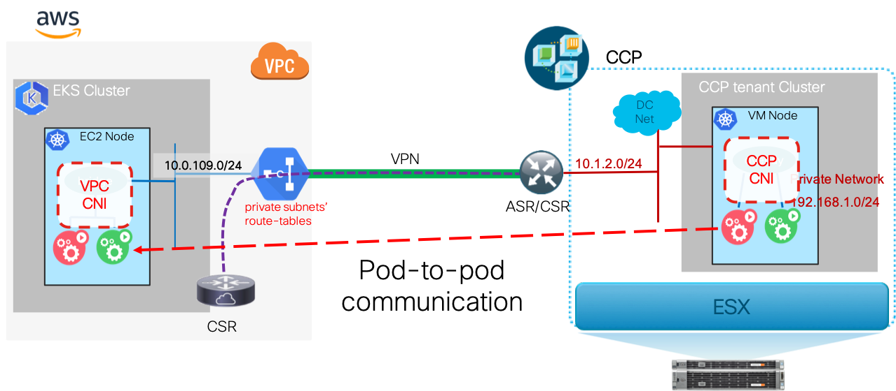
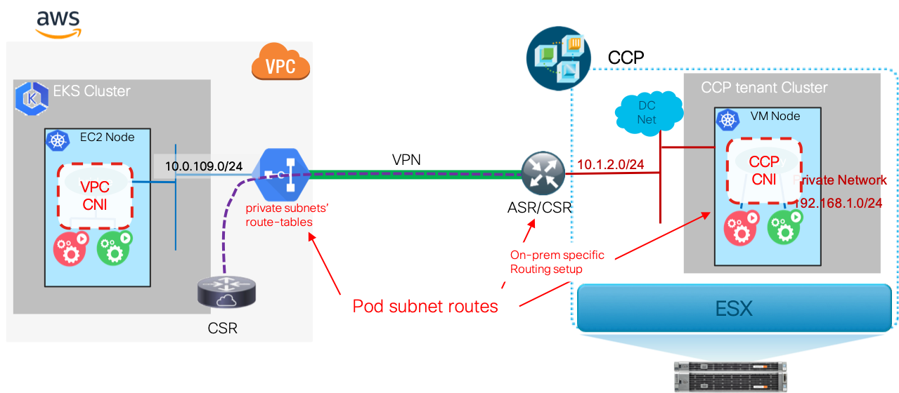

# Enabling Hybrid Cloud Pod Networking for the AWS CSR-DMVPN Model

This section describes the additional steps for enabling inter-k8s cluster pod-to-pod networking without NAT in the CCP & AWS CSR DMVPN model.  

**Figure 1.  Pod-to-pod communication between pods in EKS and on-prem CCP tenant clusters.**



## AWS VPC Steps

Deployment of the AWS VPC side of the DMVPN, the Cisco CSR was used to create the DMVPN connection.  The Cloudformation template to deploy the CSR instance creates routes to the CSR instance for the on-premises IP CIDR in the VPC's routing tables for the private subnets.  The on-premises IP CIDR is for the network that the CCP tenant clusters' nodes are deployed on.  This allows reaching the Kubernetes *nodes* in any on-premises CCP tenant clusters.

### VPC Route-tables

Given that the default route for VPC private subnets is the VPC NAT Gateway, the CCP tenant Kubernetes clusters' pod network CIDRs will be routed to the VPC NAT Gateway instead of through the DMVPN connection.  To route on-premises pod CIDRs through the DMVPN, the VPC's private subnets' route tables need to have routes added for any on-premises clusters' pod CIDRs with a next-hop of the VPC's CSR.

**Figure 2.  Pod Route Distribution to VPC private subnets' route-tables.**



The following shows example AWS CLI commands to update the private subnet route tables to add routes for the on-premises clusters' pod CIDRs.

```
# find the route tables for the private subnets in the VPC created by CCP
# Required shell vars:
# CLUSTERNM=<name of AWS cluster>
# ONPREMPODCIDR=<on-prem CCP tenant cluster's pod CIDR>
$ VpcId=$(aws ec2 describe-vpcs | jq ".Vpcs[] | select(.Tags[]?.Value | contains(\"${CLUSTERNM}\")) | .VpcId")
$ PrivateRouteTableId1=$(aws ec2 describe-route-tables --filters "Name=vpc-id,Values=$VpcId" "Name=tag:Name,Values=*private-route-table1" | jq '.RouteTables[].RouteTableId' | tr -d '"')
$ PrivateRouteTableId2=$(aws ec2 describe-route-tables --filters "Name=vpc-id,Values=$VpcId" "Name=tag:Name,Values=*private-route-table2" | jq '.RouteTables[].RouteTableId' | tr -d '"')
$ PrivateRouteTableId3=$(aws ec2 describe-route-tables --filters "Name=vpc-id,Values=$VpcId" "Name=tag:Name,Values=*private-route-table3" | jq '.RouteTables[].RouteTableId' | tr -d '"')

# get the CSR ENI ID on the private subnet
csr_inst=$(aws ec2 describe-instances --filters "Name=vpc-id,Values=$VpcId" "Name=tag:Name,Values=*csr*" | jq '.Reservations[0]["Instances"][0].InstanceId')
csr_priv_eni=$(aws ec2 describe-network-interfaces --filters "Name=vpc-id,Values=$VpcId" "Name=attachment.instance-id,Values=$csr_inst" | jq '.NetworkInterfaces[] | select(.TagSet[].Key=="Name" and (.TagSet[].Value|test(".*private.*"))) | .NetworkInterfaceId')

# create the routes for each private route table
aws ec2 create-route --destination-cidr-block $ONPREMPODCIDR --network-interface-id $csr_priv_eni --route-table-id $PrivateRouteTableId1
aws ec2 create-route --destination-cidr-block $ONPREMPODCIDR --network-interface-id $csr_priv_eni --route-table-id $PrivateRouteTableId2
aws ec2 create-route --destination-cidr-block $ONPREMPODCIDR --network-interface-id $csr_priv_eni --route-table-id $PrivateRouteTableId3
```

### Security Groups

The VPC security groups restrict pod reachability to sources within the VPC private networks.  The security groups for worker nodes need to be updated to add ingress rules for traffic from the on-prem clusters' node and pod CIDRs.

```
# Required shell vars:
# CLUSTERNM=<name of AWS cluster>
# ONPREMCIDR=<on-prem CCP node network CIDR>
# ONPREMPODCIDR=<on-prem CCP tenant cluster's pod CIDR>
$ VpcId=$(aws ec2 describe-vpcs | jq ".Vpcs[] | select(.Tags[]?.Value | contains(\"${CLUSTERNM}\")) | .VpcId")
$ worker_sg=$(aws ec2 describe-security-groups --filters Name=vpc-id,Values=$VpcId | jq '.SecurityGroups[] | select(.GroupName|test(".*worker.group.*")) | .GroupId' | tr -d '"')
$ aws ec2 authorize-security-group-ingress --group-id ${worker_sg} --protocol -1 --cidr ${ONPREMCIDR}
$ aws ec2 authorize-security-group-ingress --group-id ${worker_sg} --protocol -1 --cidr ${ONPREMPODCIDR}
```

### EKS Pod SNAT

By default, the AWS VPC CNI automatically installed in EKS clusters will perform SNAT on any pod traffic leaving the EKS nodes.  This is unnecessary for the EKS clusters set up by CCP and the DMVPN interconnect scenario as the EKS pods receive IPs from the private subnets and are routed in the VPC via the private-subnets' route-tables.  The AWS VPC CNI procedure for disabling pod SNAT is describe [in the AWS documentation for external-SNAT](https://docs.aws.amazon.com/eks/latest/userguide/external-snat.html).

## Example Automation

[bringup_aws_cluster.py](../../../automation/scripts/bringup_aws_cluster.py) -- Uses CCP to create an AWS EKS cluster, disables SNAT in the cluster, and enables calico for network-policy.

[bringup_csr.py](../../../automation/scripts/bringup_csr.py) -- Uses AWS CloudFormation to bringup a CSR & DMVPN configuration in a CCP created AWS VPC and performs the actions to enable inter-cluster pod-routing.

### Bringup AWS Cluster

**Example Usage:**
`bringup_aws_cluster.py --ccpIp 127.0.0.1 --ccpPort 29443 --ccpPassword 'password123' --providerStr myCcpAwsProvider --clusterCfgFile /cfg/my_aws_clustercfg.yaml`

**Example clusterCfgFile:**
```
---
name: eksCluster1
subnet:
  cidr: 10.0.0.0/16
  publicCidrs:
    - 10.0.106.0/24
    - 10.0.107.0/24
    - 10.0.108.0/24
  privateCidrs:
    - 10.0.109.0/24
    - 10.0.110.0/24
    - 10.0.111.0/24

role_arn_name: k8s-ccp-user

ssh_keys:
  - my-ec2-key

kubeconf_file: /cfg/kubeconfig-eksCluster1.yaml

# Apply recommended Calico CNI for network-policy capability
apply_manifests:
  - https://raw.githubusercontent.com/aws/amazon-vpc-cni-k8s/master/config/v1.3/calico.yaml

```

### Bringup DMVPN via CSR

**Example Usage:**
`bringup_csr.py --vpcNamePrefix eksCluster1 --sshKey my-ec2-key --onPremCidr 10.1.0.0/16 --onPremPodCidr 192.168.0.0/16 --clusterCfgFile /cfg/my_aws_clustercfg.yaml --dmvpnCfgFile /cfg/ccp_aws_dmvpn_conf.yaml --debug`

**Example CSR bringup dmvpnCfgFile:**
```
---
InstanceType: c4.large
InboundSSH: 0.0.0.0/0
ike_keyring_peer:
  ip_range:
    start: 0.0.0.0
    end: 0.0.0.0
  pre-shared-key: abcdef0123456789abcd

# give public IP for on-prem IPSec peer
ike_profile:
  remote_peer_ip:  172.16.0.10

# IP of DMVPN endpoint
DmvpnIp: 10.250.0.9
DmvpnNetmask:  255.255.255.0

nhrp:
  key:          abcd1234
  HubTunnelIP:  10.250.0.1

ospf:
  processId: 10
  authKey: ABCDEF0123456789AB
  tunnelNetwork: 10.250.0.0
  tunnelWildcard: 0.0.0.255
  vpcArea: 2
  tunnelArea: 0

```
