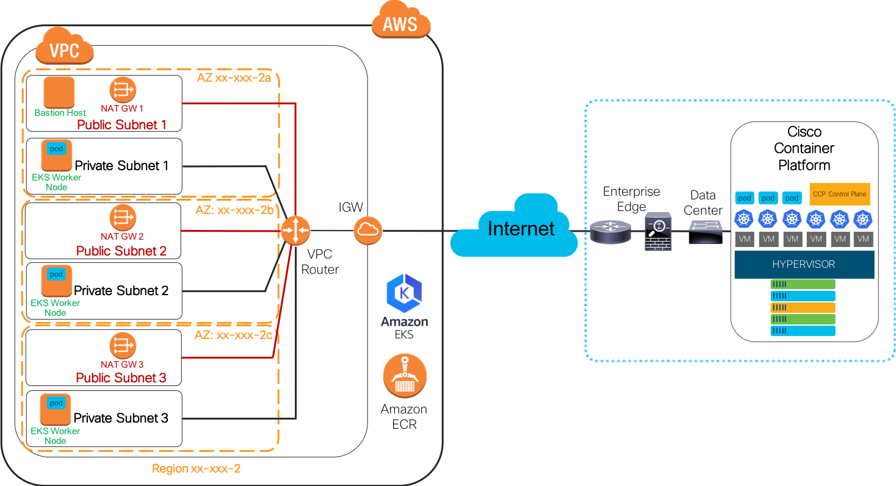
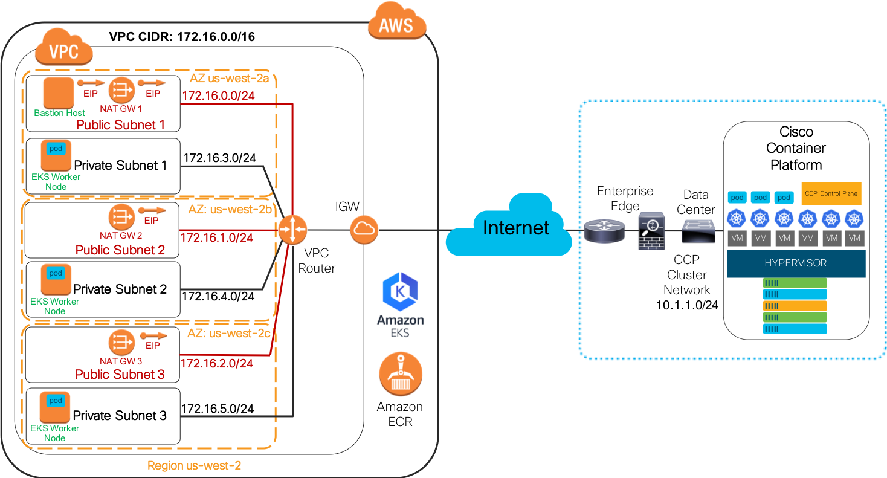
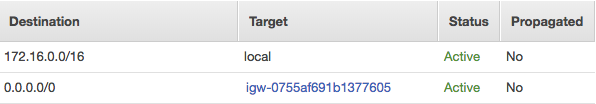
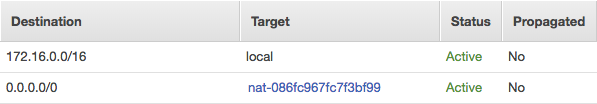
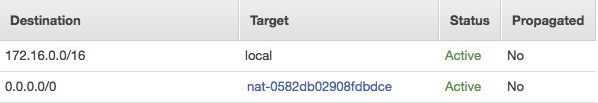
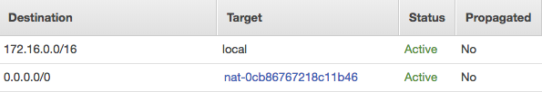
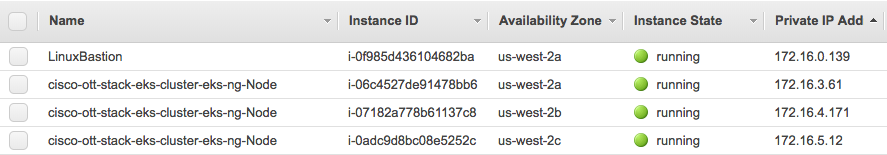
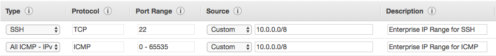
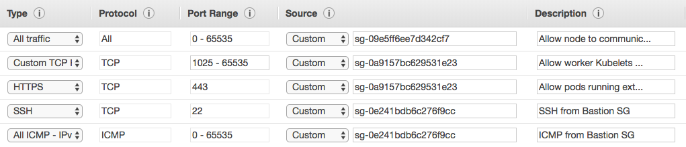
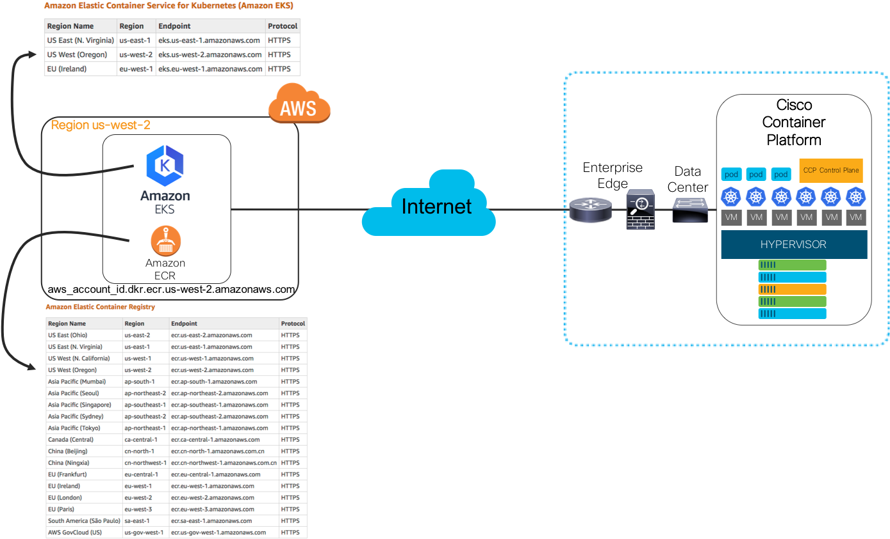

# Hybrid Cloud - Internet Over-the-Top Network Deployment

## Table of Contents
[Introduction](#introduction)

[Prerequisites](#prerequisites)

[Reference Topology](#reference-topology)

[AWS Over-the-Top Network Deployment](#aws-over-the-top-network-deployment)

[Enterprise Over-the-Top Network Deployment](#enterprise-over-the-top-network-deployment)

[Summary](#summary)

## Introduction

The following documentation provides deployment guidance for a use case that uses an Internet Over-the-Top (OTT) network deployment. The use case leverages the [Cisco Container Platform](https://www.cisco.com/c/en/us/products/cloud-systems-management/container-platform/index.html) and its automated deployment of an Enterprise on-premises [Kubernetes](https://kubernetes.io/) cluster, an automated deployment of an [Elastic Container Service for Kubernetes Service (EKS)](https://aws.amazon.com/eks/) cluster and an [Elastic Container Registry (ECR)](https://aws.amazon.com/ecr/) repository at [Amazon Web Services (AWS)](https://aws.amazon.com/).

The Internet OTT network deployment leverages existing public Internet connectivity between an Enterprise Edge Data Center and AWS. Enterprise on-premises workloads running on the Cisco Container Platform that need to connect to Amazon services will traverse the Enterprise/Internet Edge tier and connect to the public Amazon service endpoints which include, but are not limited to:
* [Amazon Elastic Compute Service (EC2)](https://aws.amazon.com/ec2/)
* [Amazon Virtual Private Cloud (VPC)](https://aws.amazon.com/vpc/)
* [Amazon Elastic Container Service for Kubernetes (EKS)](https://aws.amazon.com/eks/)
* [Amazon Elastic Container Registry (ECR)](https://aws.amazon.com/ecr/)

There are a couple of options in an AWS environment for how Amazon EC2 instances (to include the EKS worker nodes) access resources on networks outside of AWS and how Amazon EC2 instances are accessed by resources on networks outside of AWS:

* [Network Address Translation (NAT) Gateway](https://docs.aws.amazon.com/vpc/latest/userguide/vpc-nat-gateway.html) - EKS worker nodes will use an Amazon NAT Gateway as their default gateway for Internet-facing connectivity. Cisco Container Platform-hosted microservices will be reachable by the EKS worker nodes via a public IP endpoint (e.g., Load-balancer Virtual IP [VIP]) located at the Enterprise Edge. **Note:** It is up to the developer or operations team to deploy an Amazon EC2 Linux Bastion/jump host so that secure external connectivity into the VPC and the various Amazon EC2 nodes (to include the EKS worker nodes) can take place. This document does not provide guidance on how to deploy the Linux Bastion host, but Amazon does provide a reference deployment for [Linux Bastion Hosts on AWS](https://docs.aws.amazon.com/quickstart/latest/linux-bastion/architecture.html) which includes an [Amazon CloudFormation](https://aws.amazon.com/cloudformation/) [Quick Start Launcher](https://docs.aws.amazon.com/quickstart/latest/linux-bastion/welcome.html).
* [Elastic IP (EIP)](https://docs.aws.amazon.com/AWSEC2/latest/UserGuide/elastic-ip-addresses-eip.html) - EKS worker nodes are assigned an EIP that is used for outbound connectivity through an [Amazon VPC Internet Gateway (igw)](https://docs.aws.amazon.com/vpc/latest/userguide/VPC_Internet_Gateway.html). In addition to outbound Internet access, conditionally, the Enterprise security policy may allow for limited access (e.g., SSH access) to each EKS worker node via direct access through the publically routable EIP.

**Note:** The Enterprise Cloud and network security team and their policies mandate which of these two options are used. In this document, the NAT Gateway model is used. The EIP model is not discussed.

 **Figure 1** below is a high-level diagram of the overall Internet OTT network deployment.

**Figure 1. AWS VPC, Subnet, EKS, ECR, and Cisco CCP Topology Overview**



In **Figure 1** shown above, The Cisco Container Platform is deployed at the Enterprise Data Center located on the right side of the diagram. At the time of writing this documentation, the Cisco Container Platform is deployed in virtual machines (VMs) that are hosted on a VMware vSphere environment.  For the sake of the Internet OTT network deployment, it does not matter how the Cisco Container Platform connects to the Internet. Just so outbound Internet connectivity to the Amazon service endpoints is allowed for the relevant destination IPs (based on Amazon region) and the service endpoint ports (e.g., TCP port 443), then the solution will work. In this example, the Cisco Container Platform connects to the Data Center which is then connected to the Enterprise/Internet Edge. Again, for the sake of the Internet OTT network deployment example, the exact products, solutions, and network design do not matter just so that outbound connectivity is allowed from the Cisco Container Platform to the relevant Amazon service endpoints.

On the left side of the diagram is the Amazon high-level topology. The Cisco Container Platform automation creates a VPC at AWS within a defined region. The Cisco Container Platform creates an Internet Gateway (IGW) and at least six subnets in the VPC. Three subnets are used for 'public' (e.g. Internet) access, and three or more subnets are used as 'private' subnets by each of the EKS worker nodes.  For availability purposes, a public and private subnet are assigned to each of the three AZs shown. In this use case, each public subnet will have a NAT Gateway attached and, optionally (but shown), one or more Linux Bastion/jump hosts. The NAT Gateway is used for outbound Internet access by the EKS worker nodes (and any other EC2 instance that does not have an EIP assigned). In this use case, the EKS worker nodes use the NAT Gateway as their default gateway out to the Internet. The example topology indicates that one EKS worker node is attached to each [Availability Zone (AZ)](https://docs.aws.amazon.com/AWSEC2/latest/UserGuide/using-regions-availability-zones.html) in the region.

**Note:** NAT Gateways are highly available within an AZ, but if additional high availability is needed for the NAT Gateways in the event of a subnet or AZ failure then you can modify the private route table(s) and set the Target to a functional NAT Gateway. Amazon provides documentation and a basic NAT monitoring script that can be modified to allow for each NAT Gateway to monitor each other and in the event that the subnet or AZ that the NAT Gateway is located in goes down, private subnet route tables will be updated so that instances can use another NAT Gateway in another AZ.  The following documentation is focused on NAT Instances but can be modified to be used for NAT Gateways. Refer to the [High Availability for Amazon VPC NAT Instances](https://aws.amazon.com/articles/high-availability-for-amazon-vpc-nat-instances-an-example/)

 Additionally, in the diagram, the Amazon EKS control plane cluster and Amazon ECR services are shown. Connectivity to the Amazon EKS control plane cluster and the Amazon ECR service by Cisco Container Platform workloads occur through the regional Amazon public endpoint for each of those services (EKS/ECR).

## Prerequisites

The following items are considered prerequisites for the Internet OTT network deployment discussed in this document:

**Cisco Container Platform:**
  * Deploy an Enterprise on-premises Cisco Container Platform tenant cluster.
  * Using the Cisco Container Platform AWS automation capabilities, deploy an Amazon VPC, Internet Gateway, subnets, route tables, security groups, and NAT Gateways.
  * Using the Cisco Container Platform AWS automation capabilities, deploy an Amazon EKS cluster, EKS worker nodes and, optionally, an Amazon ECR repo.
  * Establish outbound Internet access from the Enterprise on-premises tenant cluster to the Amazon region/AZ service endpoints for Amazon EKS and ECR.

**Amazon Web Services:** Assuming that the relevant Amazon components and services have been created by the Cisco Container Platform, the following Amazon-specific items may be needed/wanted for this use case to be deployed successfully:
  * You should have a solid understanding of how Amazon IAM/Roles, VPCs, subnets, route tables, security groups, and NAT Gateways function.
  * For the Kubernetes and microservice user/operator, it is required to understand how Amazon EKS and ECR function, especially when dealing with security groups, Docker/Kubernetes private repository access and day-to-day maintenance and operation of the EKS cluster(s).
  *  Linux Bastion/jump host (optional but highly desired): This host is used for SSH access from the Enterprise site and used to connect to the EKS worker nodes (EC2 instances) and any other EC2 instance deployed in that region.
  * Validate that the Amazon EKS worker nodes can reach:
    * Other Amazon services such as the Amazon ECR repo.
    * If required and allowed, outbound access from the worker nodes to the public IP endpoint for the Enterprise on-premises microservice hosted on the Cisco Container Platform.


## Reference Topology

**Figure 2** is a more detailed diagram of the specific use case deployment used in this document. The diagram will be used as a reference for the deployment explanation throughout the rest of this document.

**Note:** This is just an example deployment and your specific VPC/Subnet CIDR ranges, security groups and routes will differ depending on your own network or security policies and design.

**Figure 2. Detailed Topology View for the Amazon VPC, EKS, ECR, and Cisco Container Platform Deployment**




## AWS Over-the-Top Network Deployment

Using **Figure 2** as the reference topology, we will walk through the Amazon-specific networking details based on the Internet OTT network deployment.  As stated in the [Prerequisites](#prerequisites) section, the Cisco Container Platform will create the Amazon VPC, Internet Gateway, at least six subnets, security groups, routes, NAT Gateway, Amazon EKS cluster/worker nodes and, optionally, an Amazon ECR repository.

Let's walk through the topology shown in **Figure 2** and validate that topology using the Amazon Console, kubectl commands and other verification tools (e.g., ping, traceroute).

**Reminder**: The topology, names/tags, CIDRs, number of AZs, number of EKS nodes, etc.. are for reference only. Your actual deployment details will differ from what is shown here.

In **Figure 2**, the example deployment created by the Cisco Container Platform includes the following:
* A single VPC in the Amazon region: us-west-2.
* The single VPC has a CIDR of 172.16.0.0/16.
* There are 3 AZs: us-west-2a, us-west-2b, and us-west-2c.
* There are six subnets inside of the VPC:
  * The three public subnets are using the IPv4 CIDRs of 172.16.0.0/24, 172.16.1.0/24, and 172.16.2.0/24 respectively. These subnets will be used for the NAT Gateways and, optionally, one or more Linux Bastion/jump host(s) (not deployed by Cisco Container Platform). There is a public subnet in each of the Amazon AZs. Each subnet has a public route table that has a default route aiming at the IGW that was deployed by the Cisco Container Platform.
  * The three private subnets are using the IPv4 CIDRs of 172.16.3.0/24, 172.16.4.0/24, and 172.16.5.0/24, respectively. Amazon EKS worker nodes use these subnets. Each private subnet is associated w ith its own private route table that has a default route aiming at the NAT Gateway located in the same AZ as the private subnet. These subnets are placed in Amazon AZs: us-west-2a, us-west-2b, and us-west-2c, respectively.  **Note:** See the Cisco Container Platform documentation on how the placement is handled via the automation.
* There is a single Amazon EKS Cluster, and there are three Amazon EKS worker nodes deployed.
* There is a single Amazon ECR repository.

In addition to the above resources, a single Linux Bastion/jump host is deployed via a basic Amazon CloudFormation template, not by the Cisco Container Platform. This Linux Bastion host will be used for SSH access from the Enterprise site and then used to SSH into the EKS worker nodes for network access validation.  It is up to the customer to deploy a Bastion/jump host resource and to also create/update any route tables and security groups according to their security and network policies.

Let's validate a few things from the summary list of resources shown above. The basic stuff that we want to validate includes:
* Ensure that the correct entries are in the public and private route tables.
* Ensure that the placement of each EC2 instance (EKS workers and Linux Bastion host) is in the correct Amazon AZ.
* Ensure access from the EKS worker nodes to the Internet.
* Obtain the source IP address used by a NAT Gateway so that any access control lists (ACLs) at the Enterprise site can be updated to allow access from that IP to any Cisco Container Platform resources exposed at the Enterprise/Internet edge.
* A quick test of the ECR repo from one of the EKS worker nodes using Docker.

### Route Table Validation

**Figure 3** indicates one of the three Amazon VPC public route tables. Only one is shown as all three are identical. There is a default route (0.0.0.0/0) with a target of the Internet Gateway (igw-xxxx). This route allows for outbound forwarding from any EC2 instance on the public subnets to go out directly to the Internet and Amazon service endpoints via the IGW.

**Figure 3. Amazon VPC Public Route Table**



**Figure 4a-c** indicate the Amazon VPC private route table for each private subnet. There is a default route (0.0.0.0/0) with a target of the NAT Gateway (nat-xxxx) that is associated with the same AZ the subnet is located in. Each private route table allows for outbound forwarding from any EC2 instance on each private subnet to go out to the Internet and Amazon service endpoints via the NAT Gateway.

**Figure 4a. Amazon VPC Private Route Table us-west-2a**



**Figure 4b. Amazon VPC Private Route Table us-west-2b**



**Figure 4c. Amazon VPC Private Route Table us-west-2c**



### Amazon EC2 Instance Placement in an AZ

The Cisco Container Platform automation creates subnets and places each one in an AZ. **Table 1** shows a mapping of subnet-to-AZ placement used in this document.

**Table 1. Mapping of Subnets to AZs**

Subnet | Availability Zone
------ | -----------------
172.16.0.0/24 | us-west-2a
172.16.3.0/24 | us-west-2a
172.16.1.0/24 | us-west-2b
172.16.4.0/24 | us-west-2b
172.16.2.0/24 | us-west-2c
172.16.5.0/24 | us-west-2c

**Figure 5** indicates a list of Amazon EC2 instances and their AZ placement. You can see that the Linux Bastion host is in the public subnet (172.16.0.0/24) and it is in the us-west-2a AZ. Each EKS worker node is placed on a different private subnet and each in a different AZ.

**Figure 5. Amazon EC2 and AZ Placement**



### Access from the EKS Worker Nodes to the Internet

During the Amazon CloudFormation build of the Linux Bastion host, the source IP range of the Enterprise was used to create relevant security group entries for the Linux Bastion host. **Figure 6** indicates a sample security group that allows for SSH and ICMP from the bogus IPv4 CIDR range of the Enterprise site. In this example, the Enterprise IPv4 public CIDR range is an [RFC 1918](https://tools.ietf.org/html/rfc1918) private IP range of 10.0.0.0/8. In a real deployment, this range could be one publically routable IPv4 prefix or many depending on the source IP ranges and the Enterprise security policy.

**Figure 6. Example Linux Bastion Host Security Group**



Before we can access the EKS worker nodes from the Linux Bastion host, we have to modify the default EKS worker node security group to allow for SSH access from the Linux Bastion host security group referenced above.  In **Figure 7**, two new security group entries are made in the EKS worker node security group (Reminder, the Cisco Container Platform created the EKS worker nodes and their security group). The two new security group entries allow for SSH and ICMP from the Linux Bastion host security group. **Note:** This is only an example. You will need to configure every security group according to your own Enterprise network and security policy.

**Figure 7. Example Amazon EKS Worker Node Security Group**



From the Enterprise site, SSH into the Linux Bastion host and from there ping or SSH into the EKS worker nodes. You can gather the IP addresses via the AWS Console or Command Line Interface (CLI) - 'aws ec2 describe-instances'.

Using the Private IPv4 Addresses listed in **Figure 5**, ping each EKS worker node from the Linux Bastion host:
```
[ec2-user@ip-172-16-0-139 ~]$ ping 172.16.3.61 -c2
PING 172.16.3.61 (172.16.3.61) 56(84) bytes of data.
64 bytes from 172.16.3.61: icmp_seq=1 ttl=255 time=0.424 ms
64 bytes from 172.16.3.61: icmp_seq=2 ttl=255 time=0.406 ms
```

```
[ec2-user@ip-172-16-0-139 ~]$ ping 172.16.4.171 -c2
PING 172.16.4.171 (172.16.4.171) 56(84) bytes of data.
64 bytes from 172.16.4.171: icmp_seq=1 ttl=255 time=0.831 ms
64 bytes from 172.16.4.171: icmp_seq=2 ttl=255 time=0.822 ms
```

```
[ec2-user@ip-172-16-0-139 ~]$ ping 172.16.5.12 -c2
PING 172.16.5.12 (172.16.5.12) 56(84) bytes of data.
64 bytes from 172.16.5.12: icmp_seq=1 ttl=255 time=1.16 ms
64 bytes from 172.16.5.12: icmp_seq=2 ttl=255 time=1.44 ms
```

Alternatively, you can gather the hostnames of the EKS worker nodes via the AWS Console (EC2 > Instances> Private DNS entry), AWS CLI ('aws ec2 describe-instances') or using 'kubectl' (shown below).  The following output is using 'kubectl' from a host located at the Enterprise site. You can set up kubectl for access to your Amazon EKS cluster by following the guidance in the [EKS user guide](https://docs.aws.amazon.com/eks/latest/userguide/configure-kubectl.html).

```
# kubectl get nodes
NAME                                         STATUS    ROLES     AGE       VERSION
ip-172-16-3-61.us-west-2.compute.internal    Ready     <none>    3m        v1.10.3
ip-172-16-4-171.us-west-2.compute.internal   Ready     <none>    3m        v1.10.3
ip-172-16-5-12.us-west-2.compute.internal    Ready     <none>    3m        v1.10.3
```
Ping the DNS name from the Linux Bastion host:

```
[ec2-user@ip-172-16-0-139 ~]$ ping ip-172-16-3-61.us-west-2.compute.internal -c2
PING ip-172-16-3-61.us-west-2.compute.internal (172.16.3.61) 56(84) bytes of data.
64 bytes from ip-172-16-3-61.us-west-2.compute.internal (172.16.3.61): icmp_seq=1 ttl=255 time=0.480 ms
64 bytes from ip-172-16-3-61.us-west-2.compute.internal (172.16.3.61): icmp_seq=2 ttl=255 time=0.431 ms
```
Now, SSH into one of the EKS worker nodes and validate outbound connectivity to the Internet (via the NAT Gateway). **Note:** You will need to copy an existing SSH key or create a new one and apply it to the EKS worker nodes in order to securely connect from the Linux Bastion host to the EKS worker nodes. In this example, an existing SSH key was copied to the Linux  Bastion host.

```
[ec2-user@ip-172-16-0-139 ~]$ ssh -i eks.pem ec2-user@ip-172-16-3-61.us-west-2.compute.internal
...OUTPUT_SUMMARIZED...
Are you sure you want to continue connecting (yes/no)? yes

       __|  __|_  )
       _|  (     /   Amazon Linux 2 AMI
      ___|\___|___|

https://aws.amazon.com/amazon-linux-2/
[ec2-user@ip-172-16-3-61 ~]$
```

Ping a DNS name or IPv4 address on the Internet:
```
[ec2-user@ip-172-16-3-61 ~]$ ping www.cisco.com -c 2 -n
PING e2867.dsca.akamaiedge.net (69.192.206.157) 56(84) bytes of data.
64 bytes from 69.192.206.157: icmp_seq=1 ttl=44 time=9.32 ms
64 bytes from 69.192.206.157: icmp_seq=2 ttl=44 time=9.02 ms
```
Optionally, you can install a Linux utility such as traceroute and verify that the EKS worker node is exiting the Amazon network via the NAT Gateway. **Note:** Ensure you are not violating an Enterprise security policy by installing disallowed packages. :-)

The output below indicates part of a traceroute from one of the EKS worker nodes to www.cisco.com.  We care about the first hop shown. The output shows that the first hop is the IPv4 address of the 'Private IP Address' of the NAT Gateway. **Figure 8** indicates the 'Private IP Address' information of each of the NAT Gateways. The EKS worker node that we are testing from uses the first NAT Gateway listed in **Figure 8**  which has a Private IP Address of 172.16.0.106. This IPv4 address matches what is shown in the first hop of the traceroute. Also, in **Figure 8**, the 'Elastic IP Address' (EIP) is shown. This EIP can be referenced in any ACLs at the Enterprise site by routers/firewalls that need to allow inbound access to any public IPv4 endpoints (e.g., load-balancer VIP) that the EKS worker nodes need to access. **Note:** You should verify these paths for each EKS worker node for each NAT Gateway.
```
[ec2-user@ip-172-16-3-61 ~]$ traceroute www.cisco.com -m 3
traceroute to www.cisco.com (69.192.206.157), 3 hops max, 60 byte packets
 1  ip-172-16-0-106.us-west-2.compute.internal (172.16.0.106)  0.378 ms  0.181 ms  0.328 ms
 2  ec2-50-112-0-100.us-west-2.compute.amazonaws.com (50.112.0.100)  19.601 ms ec2-34-221-151-134.us-west-2.compute.amazonaws.com (34.221.151.134)  13.548 ms ec2-50-112-0-96.us-west-2.compute.amazonaws.com (50.112.0.96)  15.622 ms
 3  100.66.16.138 (100.66.16.138)  14.839 ms 100.66.8.96 (100.66.8.96)  20.312 ms 100.66.16.84 (100.66.16.84)  16.970 ms
 ```

**Figure 8. NAT Gateway**


### EKS Worker Node Access to Amazon ECR Repository

The final validation step for the Amazon side of things will be to validate that we can perform a Docker push to the Amazon ECR repository that the Cisco Container Platform set up.  **Note:** This document does not discuss the IAM requirements to perform the following test.

In the following example, we are using the Amazon ECR repository set up by the Cisco Container Platform. The example repository, in this case, is called "cisco-ott-stack-ecr-repo". In the AWS Console > Amazon ECS > Amazon ECR > Repositories screen, you will find the repository. In that screen, there is a "View Push Commands". Using these steps is the quickest way to validate access to the ECR repository.

Once you perform the 'aws ecr get-login' and 'docker login' steps shown in the AWS instructions, [build a test Docker image](https://docs.docker.com/develop/develop-images/baseimages/), tag the image and then push the image to the repository.

#### Docker Build on an EKS Worker Node
```
[ec2-user@ip-172-16-3-61 ~]$ sudo docker build -t cisco-ott-stack-ecr-repo .
Sending build context to Docker daemon  6.656kB
Step 1/11 : FROM ubuntu:18.04
18.04: Pulling from library/ubuntu
124c757242f8: Pull complete
9d866f8bde2a: Pull complete
fa3f2f277e67: Pull complete
398d32b153e8: Pull complete
afde35469481: Pull complete
...OUTPUT SUMMARIZED...
Successfully built 56e772f321ca
Successfully tagged cisco-ott-stack-ecr-repo:latest
```
#### Docker Tag on an EKS Worker Node
```
[ec2-user@ip-172-16-3-61 ~]$ sudo docker tag cisco-ott-stack-ecr-repo:latest <ACCOUNT_ID>.dkr.ecr.<REGION>.amazonaws.com/cisco-ott-stack-ecr-repo:latest
```
#### Docker Push on an EKS Worker Node
```
[ec2-user@ip-172-16-3-61 ~]$ sudo docker push <ACCOUNT_ID>.dkr.ecr.<REGION>.amazonaws.com/cisco-ott-stack-ecr-repo:latest
The push refers to a repository [<ACCOUNT_ID>.dkr.ecr.<REGION>.amazonaws.com/cisco-ott-stack-ecr-repo]
7dd1c60aa3d5: Pushed
dfdf63e73fe9: Pushed
4bca73272d03: Pushed
bcda2f78144c: Pushed
0d0fec1c3b2a: Pushed
8d7ea83e3c62: Pushed
6a061ee02432: Pushed
f73b2816c52a: Pushed
6267b420796f: Pushed
a30b835850bf: Pushed
latest: digest: sha256:78acc74e30ba8ea017288031afa9b3d2243b9b3cbee78f7ba46487a693ba651a size: 2403
```
Using the 'aws ecr' CLI, check to make sure the image is in the repository:
```
# aws ecr list-images --repository-name cisco-ott-stack-ecr-repo
{
    "imageIds": [
        {
            "imageTag": "latest",
            "imageDigest": "sha256:78acc74e30ba8ea017288031afa9b3d2243b9b3cbee78f7ba46487a693ba651a"
        }
    ]
}
```

## Enterprise Over-the-Top Network Deployment

There are a countless number of Enterprise network designs for the Data Center, Private Clouds, Enterprise/Internet Edge, Core, Campus, and WAN/Branch. As stated before, from a basic network connectivity standpoint, as long as the Cisco Container Platform can reach the public Amazon service endpoints, it does not matter which design you use. With that said, care must be taken to understand the application/microservice requirements and map those to an Enterprise network design that provides the best performance, high-availability, security, management, and automation.

In the Internet OTT network deployment discussed in this document, the Cisco Container Platform is deployed on a VMware vSphere cluster located in an Enterprise Edge Data Center. Similar to a private Enterprise Data Center, the Enterprise Edge Data Center (AKA: demilitarized zone [DMZ] Data Center) is designed to expose applications and services directly to the public Internet.

As **Figure 9** indicates, The Cisco Container Platform connects to a series of Data Center switches which then connect to an Enterprise/Internet Edge. The Enterprise/Internet Edge is comprised of several tiers of routers, firewalls, load-balancers and other, more focused, security devices.  For the sake of the Internet OTT network deployment discussed in this document, we only care about basic network connectivity between two points: Kubernetes pods running on the Cisco Container Platform and Amazon EKS pods (optionally, Amazon ECR repository).

**Figure 9. Review - Detailed Topology View for the Amazon VPC, EKS, ECR, and Cisco Container Platform Deployment**


Following along from the right side of **Figure 9**, the VMs that the Cisco Container Platform run on are connected to [VMware vSphere Distributed Switches (VDS)](https://www.vmware.com/products/vsphere/distributed-switch.html). The VMware vSphere VDS is connected to the Data Center Top-of-Rack switches via [Cisco UCS Virtual Interface Cards](https://www.cisco.com/c/en/us/products/interfaces-modules/unified-computing-system-adapters/index.html).  The Data Center switches connect into the Enterprise/Internet Edge tier, which, again, is comprised of various routers, firewalls, other security devices, and load-balancers.  Eventually, the Enterprise/Internet Edge is connected to one or more Internet Service Providers (ISPs) or, in an [Amazon DirectConnect](https://aws.amazon.com/directconnect/) or Cloud/Network Exchange model, directly to a colocation (colo) site or directly to the Cloud Provider.  No matter which model or connectivity type is used, just so IP connectivity exists between the two points discussed before (Cisco Container Platform and Amazon EKS/ECR), it's a viable solution.

### Validating IPv4 Addresses for Routing/Access Control

As mentioned in the [AWS Over-the-Top Network Deployment](#aws-over-the-top-network-deployment) section, the AWS VPC NAT Gateway Elastic IP can be used on the router/firewalls at the Enterprise/Internet Edge site to control what is allowed to/from the AWS site for a given application or service.  Similarly, the Enterprise public IP address that is used in an Enterprise Source NAT (SNAT) pool can be used to apply security group entries at AWS to control ingress access to AWS resources.

The information that needs to be provided to the relevant network/data center/security/cloud-ops teams so they can properly route and secure bi-directional traffic in the hybrid cloud includes:
* Amazon region and service endpoint information (graphical example in **Figure10**):
  * [Amazon IP address list](https://docs.aws.amazon.com/general/latest/gr/aws-ip-ranges.html#aws-ip-download)
  * [Amazon Regions and Endpoints list](https://docs.aws.amazon.com/general/latest/gr/rande.html)
    * [Region/Endpoint list for Amazon EKS](https://docs.aws.amazon.com/general/latest/gr/rande.html#eks_region)
    * [Region/Endpoint list for Amazon ECR](https://docs.aws.amazon.com/general/latest/gr/rande.html#ecr_region)

**Figure 10. Amazon EKS and ECR Regional Endpoints**


* Amazon VPC NAT Gateway Elastic IP (shown here again from **Figure 8**):

**Figure 11. NAT Gateway - A Second Look**


* Enterprise/Internet Edge SNAT IPv4 address (port overload configuration) or SNAT pool range (pool configuration). The Enterprise InfoSec or network operations team will know what these IP addresses are. If you need to find out for yourself, you can install tcpdump on the Linux Bastion host (e.g., 'sudo install tcpdump -y') and then, from the Cisco Container Platform, deploy a pod and ping the Linux Bastion host at Amazon (ensure the security group allows for SSH from your address space):
  * Deploy a test pod on the Cisco Container Platform and ping the EIP of the Linux Bastion host:
```
ccpuser@ccp-alk-01-master34f029d230:~$ kubectl run -i -t busybox --image=busybox --restart=Never
If you don't see a command prompt, try pressing enter.
/ #
```
```
/ # ping <EIP_OF_BASTION_HOST>
```
  * Install and run tcpdump on the Linux Bastion host - The tcpdump will show the Enterprise public IP address being used for SNAT (shown below as 10.1.10.1):
```
[ec2-user@ip-172-16-0-139 ~]$ sudo tcpdump -i eth0 icmp
tcpdump: verbose output suppressed, use -v or -vv for full protocol decode
listening on eth0, link-type EN10MB (Ethernet), capture size 65535 bytes
22:13:25.436274 IP 10.1.10.1 > ip-172-16-0-139.us-west-2.compute.internal: ICMP echo request, id 1792, seq 0, length 64
22:13:25.436301 IP ip-172-16-0-139.us-west-2.compute.internal > 10.1.10.1: ICMP echo reply, id 1792, seq 0, length 64
```
### Cisco Cloud Platform Access to Amazon ECR Repository

The final network and service access validation for the Internet OTT network deployment is to perform a 'docker pull' of the image that was pushed into the AWS ECR repository earlier in the document ([AWS Over-the-Top Network Deployment](#aws-over-the-top-network-deployment)):

On one of the Cisco Cloud Platform worker nodes, complete the AWS documented steps for the 'docker login' process and then perform a docker pull of the ECR image:
```
ccpuser@ccp-alk-01-worker23c5f35919:~$ sudo docker login -u AWS -p <OUTPUT_OMITTED> https://<ACCOUNT_ID>.dkr.ecr.<REGION>.amazonaws.com
Login Succeeded
```
```
ccpuser@ccp-alk-01-worker23c5f35919:~$ sudo docker pull <ACCOUNT_ID.dkr.ecr.<REGION>.amazonaws.com/cisco-ott-stack-ecr-repo:latest
latest: Pulling from cisco-ott-stack-ecr-repo
124c757242f8: Pull complete
9d866f8bde2a: Pull complete
fa3f2f277e67: Pull complete
398d32b153e8: Pull complete
afde35469481: Pull complete
b11867c51fda: Pull complete
a080d6305646: Pull complete
dc80c65fc1ce: Pull complete
6ffb782ac8f8: Pull complete
409a6d266166: Pull complete
Digest: sha256:78acc74e30ba8ea017288031afa9b3d2243b9b3cbee78f7ba46487a693ba651a
Status: Downloaded newer image for <ACCOUNT_ID>.dkr.ecr.<REGION>.amazonaws.com/cisco-ott-stack-ecr-repo:latest
```
The Cisco Container Platform worker node successfully logged into the Amazon ECR private repository and pulled the image that the Amazon EKS worker node pushed to the repository.

## Summary

The Internet OTT network deployment is a straightforward and secure method for connecting Enterprise on-premises Cisco Container Platform workloads to Amazon EKS workloads and also Amazon ECR private repositories. Again, all that is needed for this scenario to be successful is basic IP connectivity between the two extreme ends of this solution (Cisco Container Platform and the public Amazon service endpoints).

Some Enterprise security policies do not allow outbound connectivity to the Internet from within the Enterprise Data Center even though everything in use in this deployment is using secured/encrypted connections to Amazon. In cases where the Enterprise security policy mandates an IPsec VPN be deployed between the Enterprise site and Amazon or when a dedicated IPsec VPN is required for more advanced network functionality, there are several options available to accommodate these use cases.  Please reference the [Hybrid Cloud - DMVPN Network Deployment (Single Router Model)](https://wwwin-github.cisco.com/CPSG/multicloud/blob/master/aws/public/docs/network/csr-dmvpn/README.md)
