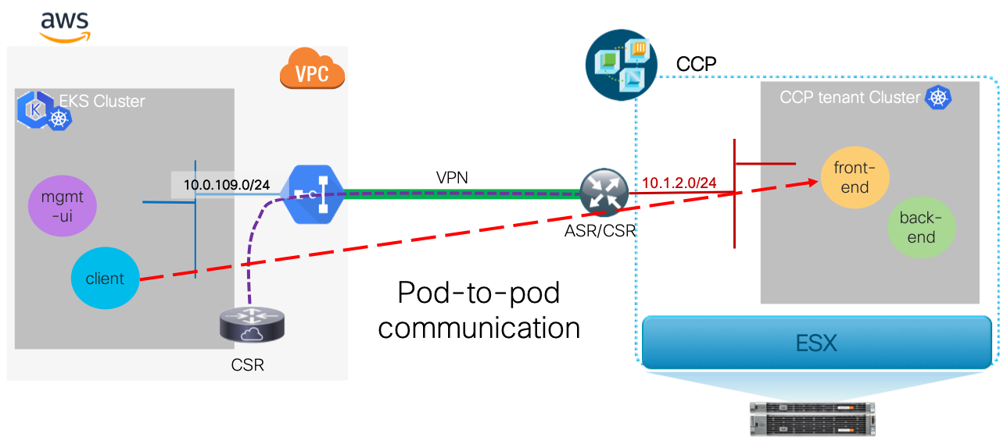
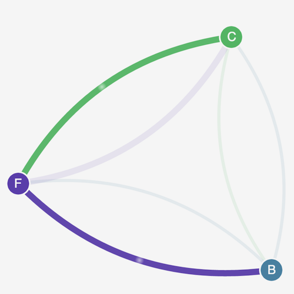

# Multicloud Network Policy Example: Calico Stars App on EKS and CCP Tenant Clusters

In this example we use the [Stars](https://docs.aws.amazon.com/eks/latest/userguide/calico.html)
example application created by the Calico project to
demonstrate the effects of Kubernetes network policies.  This example has a nice simple
User Interface (UI) that illustrates communication between microservices.  To demonstrate multicloud
network policy, we show a deployment with microservices in different clouds and example
Kubernetes network policy configurations to achieve the same behavior as the single
cluster original demo.  The example is built upon the multicloud routing capabilities
in a multicloud DMVPN design.

This example goes through expansion of the Cisco Container Platform (CCP) tenancy into
the Amazon Web Services (AWS) cloud via the CCP integrated AWS EKS deployment capability.
Additionally, we highlight the multicloud Dynamic Multipoint Virtual Private Network
(DMVPN) connectivity possibilities via use of example automation for provisioning
an AWS EC2 hosted Cisco Cloud Services Router (CSR) instance as a DMVPN endpoint
in the VPC and distributing routes to on-premises Kubernetes tenant pods into
the VPC routing infrastructure.

## Prerequisites

1. CCP installation with a local tenant Kubernetes cluster deployed.
1. CCP configured with an AWS "infrastructure provider" tied to an AWS IAM role with
   sufficient privileges to create an AWS EKS cluster.
1. For executing the scripts in this example shell environment variable `MCINTEG_ROOT`
   must be set to the root directory of the locally cloned `multicloud-integrations` repo.

## Deploying the Multicloud Clusters and DMVPN Connectivity

The following steps are an automation example for using CCP to deploy an AWS EKS cluster with
network-policy functionality (via Calico) and the
[AWS CSR-DMVPN networking model](../../../AWS/AWSConfig/networking/docs/network/csr-dmvpn/README.md).
The example automation also enables the VPC and EKS cluster for
[hybrid cloud pod networking](../../../AWS/AWSConfig/networking/docs/network/csr-dmvpn/pod-networking.md)
as the network-policy example requires inter-cluster pod-to-pod layer 3 reachability.

### Deploy the AWS EKS Cluster

The example automation [bringup_aws_cluster.py](../../../AWS/AWSConfig/networking/automation/scripts/bringup_aws_cluster.py)
is used to trigger CCP to create an AWS EKS cluster.  Additionally, it enables network-policy functionality
and disables Source Network Address Translation (SNAT) on the cluster.

**Cluster configuration file `/cfg/ccp/aws.yaml` content:**

```
---
name: aws
subnet:
  cidr: 10.0.0.0/16
  publicCidrs:
    - 10.0.106.0/24
    - 10.0.107.0/24
    - 10.0.108.0/24
  privateCidrs:
    - 10.0.109.0/24
    - 10.0.110.0/24
    - 10.0.111.0/24

role_arn_name: k8s-ccp-user

ssh_keys:
  - my-key

kubeconf_file: /cfg/aws-kubeconfig.yaml

apply_manifests:
  - https://raw.githubusercontent.com/aws/amazon-vpc-cni-k8s/master/config/v1.3/calico.yaml

```

**NOTE:** The `apply_manifests` list will apply each manifest to the AWS EKS cluster using kubectl.
In this case it applies the AWS VPC Container Network Interface (CNI) compatible Calico manifest
for the network-policy feature.

**Script Execution:**

```
$ ./bringup_aws_cluster.py --ccpIp 127.0.0.1 --ccpPort 29443 --ccpPassword 'abcd123!' --providerStr myAwsProv --clusterCfgFile /cfg/ccp/aws.yaml
```

Upon completion of the above an AWS EKS cluster named `aws` has been created by CCP and its
kubeconfig is stored in `/cfg/aws1-kubeconfig.yaml`.

### Deploy the DMVPN & Inter-cloud Pod Routing Connectivity

The example automation [bringup_csr.py](../../../AWS/AWSConfig/networking/automation/scripts/bringup_csr.py)
is used to create a Cisco CSR instance in the VPC created for the AWS EKS cluster `aws` and configure it
for the DMVPN scenario.  Additionally, the automation enables pod-to-pod routing over the DMVPN
connection between the clusters and adds the security group rules to allow traffic
between clusters' pods as detailed in
["Enabling Hybrid Cloud Pod Networking for the AWS CSR-DMVPN Model"](../../../AWS/AWSConfig/networking/docs/network/csr-dmvpn/pod-networking.md).

**DMVPN Configuration file `/cfg/ccp/dmvpn_conf.yaml` content:**

```
---
InstanceType: c4.large
InboundSSH: 0.0.0.0/0
ike_keyring_peer:
  ip_range:
    start: 0.0.0.0
    end: 0.0.0.0
  pre-shared-key: abcdefghijklmn012345

ike_profile:
  remote_peer_ip:  <public/routeable IP of the remote peer>

DmvpnIp: 10.250.0.9
DmvpnNetmask:  255.255.255.0

nhrp:
  key:          keykey00
  HubTunnelIP:  10.250.0.1

ospf:
  processId: 10
  authKey: DEADBEEF0123456789
  tunnelNetwork: 10.250.0.0
  tunnelWildcard: 0.0.0.255
  vpcArea: 2
  tunnelArea: 0
```

**Script Execution:**

```
/scripts/bringup_csr.py --vpcNamePrefix aws --sshKey my-key --onPremCidr 10.1.0.0/16 --onPremPodCidr 192.168.0.0/16 --clusterCfgFile /cfg/ccp/aws.yaml --dmvpnCfgFile /cfg/ccp/dmvpn_conf.yaml --debug
```

_Where_

  - `onPremCidr` is the on-premises network Classless Inter-domain Routing (CIDR) to allow in VPC subnet security-groups

  - `onPremPodCidr` is the on-premises Kubernetes cluster pod CIDR to allow in VPC subnet security-groups

### Verifying inter-cluster pod-to-pod communication

#### Environment setup

The following assumes an environment where `kubectl` contexts are set up such that:

- context `aws` is associated with the AWS EKS cluster
- context `ccp` is associated with the on-prem CCP cluster

**Example:**

```
$ export KUBECONFIG=/cfg/ccp-kubeconfig.yaml:/cfg/aws-kubeconfig.yaml
$ kubectl config get-contexts
CURRENT   NAME      CLUSTER          AUTHINFO               NAMESPACE
          aws       kubernetes       aws
*         ccp       ccp_kubernetes   ccp_kubernetes-admin
```

#### Verify using utility pods

This is an example using `busybox` pods (which contain basic utilities like `ping` and `curl`)
to show pod-to-pod communication over the DMVPN tunnel.

```
# start busybox on AWS cluster
$ cat <<EOF | kubectl apply --context aws -f -
apiVersion: extensions/v1beta1
kind: Deployment
metadata:
  name: busybox
spec:
  replicas: 1
  template:
    metadata:
      labels:
        app: busybox
    spec:
      containers:
      - name: busybox
        image: radial/busyboxplus
        command: ["sleep", "7200"]
        imagePullPolicy: IfNotPresent
EOF

# start busybox on ccp cluster
$ cat <<EOF | kubectl apply --context ccp -f -
apiVersion: extensions/v1beta1
kind: Deployment
metadata:
  name: busybox
spec:
  replicas: 1
  template:
    metadata:
      labels:
        app: busybox
    spec:
      containers:
      - name: busybox
        image: radial/busyboxplus
        command: ["sleep", "7200"]
        imagePullPolicy: IfNotPresent
EOF

# get pod names and IPs for each cluster
aws_pod_nm=$(kubectl get pods -l app=busybox --context aws -o jsonpath='{.items[0].metadata.name}')
aws_pod_ip=$(kubectl get pods -l app=busybox --context aws -o jsonpath='{.items[0].status.podIP}')
ccp_pod_nm=$(kubectl get pods -l app=busybox --context ccp -o jsonpath='{.items[0].metadata.name}')
ccp_pod_ip=$(kubectl get pods -l app=busybox --context ccp -o jsonpath='{.items[0].status.podIP}')

# ping from AWS busybox to CCP busybox pod
$ kubectl exec -t ${aws_pod_nm} --context aws -- ping -c3 ${ccp_pod_ip}

PING 192.168.1.184 (192.168.1.184): 56 data bytes
64 bytes from 192.168.1.184: seq=0 ttl=60 time=22.542 ms
64 bytes from 192.168.1.184: seq=1 ttl=60 time=22.503 ms
64 bytes from 192.168.1.184: seq=2 ttl=60 time=22.795 ms

--- 192.168.1.184 ping statistics ---
3 packets transmitted, 3 packets received, 0% packet loss
round-trip min/avg/max = 22.503/22.613/22.795 ms

# ping from CCP busybox to AWS busybox pod
$ kubectl exec -t ${ccp_pod_nm} --context ccp -- ping -c3 ${aws_pod_ip}

kubectl exec -t ${ccp_pod_nm} --context ccp -- ping -c3 ${aws_pod_ip}
PING 10.0.110.197 (10.0.110.197): 56 data bytes
64 bytes from 10.0.110.197: seq=0 ttl=60 time=22.718 ms
64 bytes from 10.0.110.197: seq=1 ttl=60 time=22.505 ms
64 bytes from 10.0.110.197: seq=2 ttl=60 time=22.556 ms

--- 10.0.110.197 ping statistics ---
3 packets transmitted, 3 packets received, 0% packet loss
round-trip min/avg/max = 22.505/22.593/22.718 ms
```

## Deploying the Calico Stars Application Across Clouds

The [Stars](https://docs.aws.amazon.com/eks/latest/userguide/calico.html) application consists
of 4 microservices a `frontend` service, a `backend` service, a `client` service, and
the `management-ui` service.  The `client`, `frontend`, and `backend` all attempt to send
requests to each other and the `management-ui` service polls the other 3 to indicate
the communication directions allowed.

With the desired policy applied, the allowed communication is constrained to:

- `client` is an allowed client of `frontend`
- `frontend` is an allowed client of `backend`
- `management-ui` is an allowed client of all the services (to collect data)

For our multicloud scenario, we deploy the `frontend` and `backend` of the "stars"
in the on-premises CCP tenant cluster and `client` and `management-ui` services
in the EKS cluster as shown in the following figure.

**Figure 1.** Services `frontend` and `backend` on-premises; services `client` and `management-ui` in EKS



### Deployment of Services

```
# NOTE: kubectl context "ccp" is the on-premises k8s cluster
#       context "aws" is the EKS k8s cluster with DMVPN connectivity to on-prem
STARS_MFSTS=https://docs.projectcalico.org/v3.1/getting-started/kubernetes/tutorials/stars-policy/manifests
kubectl apply --context ccp -f $STARS_MFSTS/00-namespace.yaml
kubectl apply --context ccp -f $STARS_MFSTS/02-backend.yaml
kubectl apply --context ccp -f $STARS_MFSTS/03-frontend.yaml

kubectl create ns client --context aws
kubectl apply --context aws -f $STARS_MFSTS/04-client.yaml
```

Create the management-ui as a `LoadBalancer` type service, rather than the original definition of `NodePort`:

```
cat <<EOF | kubectl apply --context aws -f -
apiVersion: v1
kind: Namespace
metadata:
  name: management-ui 
  labels:
    role: management-ui 
---
apiVersion: v1
kind: Service
metadata:
  name: management-ui 
  namespace: management-ui 
spec:
  type: LoadBalancer
  ports:
  - port: 80 
    targetPort: 9001
  selector:
    role: management-ui 
---
apiVersion: v1
kind: ReplicationController
metadata:
  name: management-ui 
  namespace: management-ui 
spec:
  replicas: 1
  template:
    metadata:
      labels:
        role: management-ui 
    spec:
      containers:
      - name: management-ui 
        image: calico/star-collect:v0.1.0
        imagePullPolicy: Always
        ports:
        - containerPort: 9001
EOF
```

**NOTE:** The use of `LoadBalancer` is to avoid having to use port-forwarding to access the UI.  The example
still functions fine if you choose to stick with the original example's `NodePort` manifest.

### Mapping Services into Each Cluster's DNS

The following uses the example automation to replicate services and endpoints to remote clusters
as described in [K8s Multicluster Services in NAT-less Hybrid Cloud](../multicluster_services.md).

```
$ cat <<EOF > ~/tmp/multicluster_stars_svcs.yaml
clusters:
- name: ccp
  kubeconfig: /cfg//cfg/ccp-kubeconfig.yaml
  services:
  - namespace: stars
- name: aws
  kubeconfig: /cfg/aws-kubeconfig.yaml
  services:
  - namespace: management-ui
  - namespace: client
EOF

$ $MCINTEG_ROOT/create_svc_endpoints.py --clusterSvcCfgFile ~/tmp/multicluster_stars_svcs.yaml --debug
```

**NOTE:** In multicloud scenarios there are many DNS considerations and solutions.  For the
sake of this example we replicate the services and pod endpoints to each remote cluster.

### Accessing the UI

Get the external service address/hostname for the `stars` UI as follows:

```
$ kubectl get svc management-ui -n management-ui --context aws -o wide
```
OR
```
$ ui_host=$(kubectl get svc management-ui -n management-ui --context aws -o jsonpath='{.status.loadBalancer.ingress[0].hostname}')
```

Access `http://${ui_host}/` to see the `management-ui` content

When accessing the UI with no network-policies applied the following should be displayed:


### Applying Network Policy

The following example applies network-policies across the 2 clusters with the result being
the same effective policy as the original [Calico Stars Demo on AWS](https://docs.aws.amazon.com/eks/latest/userguide/calico.html).

  1. Apply default deny policies to each of application services' namespaces in each cluster.

     ```
     # Apply default-deny policy to client (EKS) and stars (on-prem) namespaces
     cat <<EOF > ~/tmp/default-deny.yaml
     kind: NetworkPolicy
     apiVersion: networking.k8s.io/v1
     metadata:
       name: default-deny
     spec:
       podSelector:
         matchLabels: {}
     EOF

     kubectl apply -n stars --context ccp -f ~/tmp/default-deny.yaml
     kubectl apply -n client --context aws -f ~/tmp/default-deny.yaml
     ```

  1. Allow `frontend` as client of `backend`.  _NOTE: Since the allowed client service is in
     the same cluster as the server service, this is identical to the original example policy._

     ```
     # Apply the normal backend policy to on-prem
     cat <<EOF | kubectl apply --context ccp -f -
     kind: NetworkPolicy
     apiVersion: networking.k8s.io/v1
     metadata:
       namespace: stars
       name: backend-policy
     spec:
       podSelector:
         matchLabels:
           role: backend
       ingress:
         - from:
           - podSelector:
                      matchLabels:
                   role: frontend
           ports:
             - protocol: TCP
               port: 6379
     EOF
     ```

  1. Allow `management-ui` as client of `client`.  _NOTE: Since the allowed client service is in
     the same cluster as the server service, this is identical to the original example policy._

     ```
     # Apply the normal allow-ui-client in EKS
     cat <<EOF | kubectl apply --context aws -f -
     kind: NetworkPolicy
     apiVersion: networking.k8s.io/v1
     metadata:
       namespace: client 
       name: allow-ui 
     spec:
       podSelector:
         matchLabels: {}
       ingress:
         - from:
             - namespaceSelector:
                 matchLabels:
                   role: management-ui 
     EOF
     ```

  1. Allow `management-ui` (EKS) as client of the `stars` namespace services (on-prem).

     ```
     # Get the IP of the management-ui pod
     mgmtui_ep=$(kubectl get endpoints management-ui -n management-ui --context aws -o jsonpath="{.subsets[0].addresses[0].ip}")
     
     cat <<EOF | kubectl create --context ccp -f -
     apiVersion: extensions/v1beta1
     kind: NetworkPolicy
     metadata:
       name: allow-ui
       namespace: stars
     spec:
       podSelector:
         matchLabels: {}
       ingress:
         - from:
           - ipBlock:
               cidr: ${mgmtui_ep}/32
     EOF
     ```

     **NOTE:**  The identity of the `management-ui` workload in the network policy is its pod IP for
     policies applied to the on-premises cluster.  See the below [Limitations](#limitations) explanation.

  1. Allow `client` (EKS) as client of `frontend` (on-prem).

     ```
     # Get the IP of the client pod
     client_ep=$(kubectl get endpoints client -n client --context aws -o jsonpath="{.subsets[0].addresses[0].ip}")
     
     cat <<EOF | kubectl create --context ccp -f -
     kind: NetworkPolicy
     apiVersion: networking.k8s.io/v1
     metadata:
       namespace: stars
       name: frontend-policy
     spec:
       podSelector:
         matchLabels:
           role: frontend
       ingress:
         - from:
             - ipBlock:
                 cidr: ${client_ep}/32
           ports:
             - protocol: TCP
               port: 80
     EOF
     ```

     **NOTE:**  The identity of the `client` workload in the network policy is its pod IP for
     policies applied to the on-premises cluster.  See the below [Limitations](#limitations) explanation.

Upon completion, the desired application communication should be shown as in the image below:

**Desired Communication:** C allowed client to F, and F allowed client to B
(`client` -> `frontend` -> `backend`).



**NOTE:** In order to display the nodes in the figure, the `management-ui` service is an allowed
client to all services.


### Limitations

The enforcement of the `ingress` policy rules is at the ingress of the server pods so, for clients
outside of the server service's cluster the identity of the client workload in the network policy is
its pod IP.  The limitations of this approach are detailed in [Network Policy Limitations](../../Multicloud%20Network%20Policy/limitations.md)
but the highlights for this example are as follows:

 - SNAT has to be disabled between EKS and on-prem.  With SNAT every workload in EKS will potentially have the same
   source IP and using the SNAT CIDR would have allowed BOTH the `client` and `management-ui`
   as clients of the `backend` service when only the `management-ui` should be allowed.

 - When a Pod's IP changes this must be reflected in the network-policy configuration for
   server services with remote clients.  This potentially could require some kind of automation
   to watch for such changes.

## References

- [AWS CSR-DMVPN Model](../../../AWS/AWSConfig/networking/docs/network/csr-dmvpn/README.md)

- [Enabling Hybrid Cloud Pod Networking for the AWS CSR-DMVPN Model](../../../AWS/AWSConfig/networking/docs/network/csr-dmvpn/pod-networking.md)

- [K8s Multicluster Services in NAT-less Hybrid Cloud](../multicluster_services.md)

- [Calico Stars Demo on AWS](https://docs.aws.amazon.com/eks/latest/userguide/calico.html)
