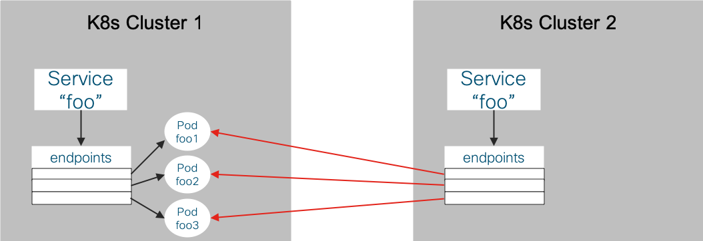

# K8s Multicluster Services in NAT-less Hybrid Cloud

In this model, it's possible to replicate Kubernetes service definitions across clusters to interwork with
functionality based on the Kubernetes API objects.  For example, a cluster's local `kube-dns` discovers
all service objects and will resolve service name lookups for all services configured, regardless of
whether the endpoints are local to the cluster.

The following illustrates how Kubernetes service and endpoint instances can be created on a cluster to
allow local DNS lookups and expression of service metadata. 

**Figure 1.** The same service definition in 2 clusters with the 2nd cluster using a selectorless service
and endpoints set to the 1st clusters pods.



## Example Automation

[create_svc_endpoints.py](scripts/create_svc_endpoints.py)

**Usage Example:**  `create_svc_endpoints.py --clusterSvcCfgFile ~/tmp/multicluster_svcs_mc_aws.yaml --debug`

**Cluster Services Config file example**
```
clusters:
- name: onPremCluster1
  kubeconfig: /cfg/kubeconfig-onPremCluster1.yaml
  services:
  - namespace: stars
- name: eksCluster1
  kubeconfig: /cfg/kubeconfig-eksCluster1.yaml
  services:
  - namespace: management-ui
  - namespace: client
```

The above example config file is for a scenario where the
[Calico stars](https://docs.projectcalico.org/v3.2/getting-started/kubernetes/tutorials/stars-policy/)
example is deployed across 2 clusters `onPremCluster1` and `eksCluster1`.  

Under each cluster instance the `services` list indicates a list of match criteria for services to
replicate to the other clusters.  In this case, `onPremCluster1` services and endpoints in the `stars`
namespace should be replicated to the other clusters (`eksCluster1`).  Also, 'eksCluster1' services and
endpoints in the `management-ui` and `client` namespaces should be replicated to the other clusters
(`onPremCluster1`).

## Considerations

The service/endpoint replication approach has the added benefits:

1. Making cluster local domain names for multicluster services
1. Allowing options for k8s metadata/annotations to be attached to endpoints regardless of whether the pods
   are local to the cluster.  This is useful for application policy/traffic management approaches that rely
   on endpoint attributes--e.g. Istio.
1. Replicating k8s objects allow for common k8s controller-based approaches for local & remote services &
   endpoints.

The service/endpoint replication approach has the following drawbacks:

1. Endpoint IPs need to be kept in sync across k8s control-planes
1. Some existing service infrastructure assumes pods are in the local cluster, ie. Calico network-policy
   implementation.


# Multicluster DNS Considerations

Replicating Kubernetes service objects and endpoint instances to multiple clusters is not the only option for
solving multicluster DNS.  There are many potential options that could be implemented purely to allow
applications to use DNS to resolve name lookups for services deployed in remote clusters.

Options include but are not limited to:

* DNS proxy configurations
  * Configuring `kube-dns` (Core DNS) to forward DNS requests to other clusters
  * Example: [kubernetai](https://github.com/coredns/kubernetai)
* Global DNS
  * Example: Consul with kubernetes adapters so discovered k8s services are setup in a common
    Consul DNS.
